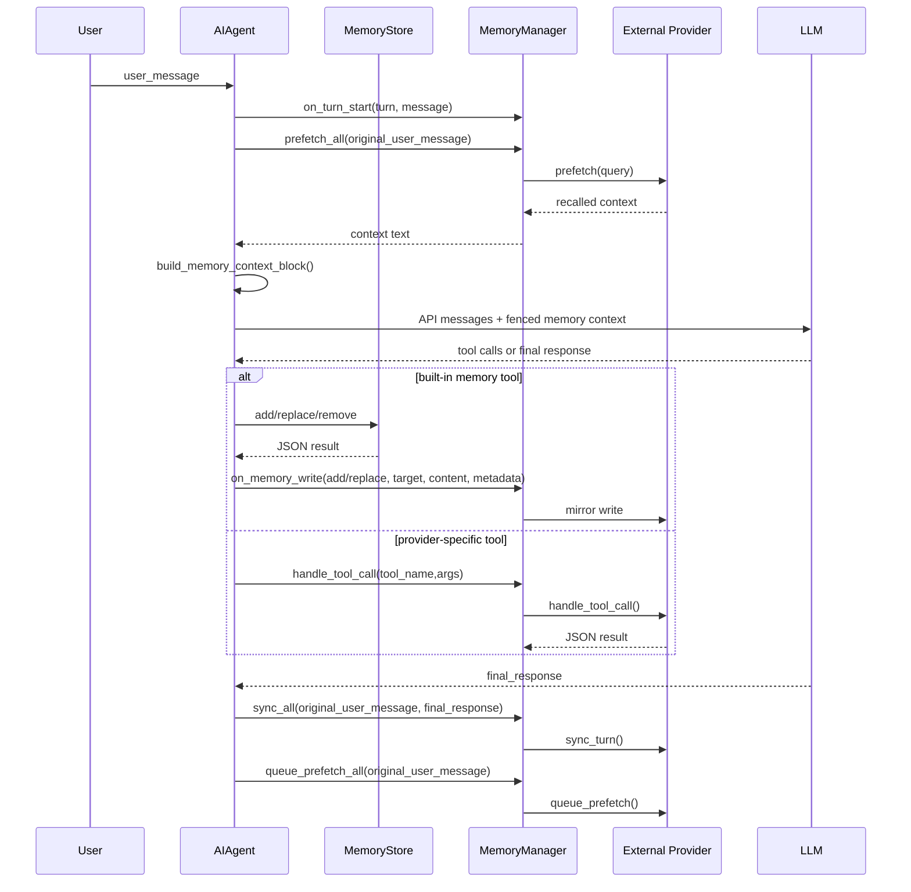

# Hermes Agent 记忆系统详细解析报告

> 范围说明：本报告基于 `记忆系统文件列表.md` 指向的实现文件阅读整理，刻意忽略 `tests/` 下测试文件。为解释主链路，补充引用了少量文件列表之外但直接参与记忆提示词编排的源码，例如 `agent/prompt_builder.py`。

## 1. 总览：Hermes 的“记忆”不是一个单一模块

Hermes Agent 的记忆系统由两条并行但互相桥接的链路组成：

1. **内置文件型记忆**
   - 由 `tools/memory_tool.py` 实现。
   - 以 `$HERMES_HOME/memories/MEMORY.md` 和 `$HERMES_HOME/memories/USER.md` 为持久化载体。
   - 通过核心工具 `memory` 让模型主动保存、替换、删除长期事实。
   - 在会话开始时把文件内容作为“冻结快照”注入 system prompt。

2. **外部 MemoryProvider 插件**
   - 抽象接口在 `agent/memory_provider.py`。
   - 编排器在 `agent/memory_manager.py`。
   - 插件发现入口是 `plugins/memory/__init__.py`。
   - 内置 provider 包括 Honcho、Hindsight、Mem0、Supermemory、OpenViking、RetainDB、ByteRover、Holographic。
   - 通过 `memory.provider` 配置一次只激活一个外部 provider。

一个容易误解的点是：`MemoryManager` 的注释里保留了“builtin provider always first”的设计表述，但当前 `run_agent.py` 并没有把内置文件记忆包装成 `MemoryProvider`。实际实现中，内置文件记忆由 `AIAgent._memory_store` 和 agent-loop 拦截的 `memory` 工具直接处理；`MemoryManager` 只在配置了外部 provider 时负责外部 provider 的生命周期、工具注入、召回和同步。

## 2. 核心数据模型

### 2.1 内置文件记忆的两个目标

`tools/memory_tool.py` 把长期记忆分成两个目标：

| target | 文件 | 含义 | 典型内容 |
| --- | --- | --- | --- |
| `memory` | `$HERMES_HOME/memories/MEMORY.md` | Agent 自己的长期笔记 | 项目约定、环境事实、工具 quirks、长期有效的工作经验 |
| `user` | `$HERMES_HOME/memories/USER.md` | 对用户的稳定画像 | 用户偏好、沟通方式、角色、反复纠正过的习惯 |

两个文件都使用同一个分隔符：

```text
\n§\n
```

每条记忆可以是多行文本；读文件时按完整分隔符拆分，避免内容里偶然出现单个 `§` 时误拆。

### 2.2 外部 provider 的抽象数据模型

外部 provider 没有统一存储格式，统一的是生命周期接口。不同 provider 的底层模型差异很大：

| Provider | 底层记忆模型 |
| --- | --- |
| Honcho | peer、session、representation、peer card、conclusion、dialectic Q&A |
| Hindsight | memory bank、document、retain/recall/reflect、knowledge graph |
| Mem0 | server-side LLM fact extraction、semantic search、profile |
| Supermemory | container tag、profile recall、semantic memory、conversation ingest |
| OpenViking | `viking://` URI 层级上下文数据库、session commit 后抽取 |
| RetainDB | cloud memory API、profile/search/context、SQLite 写后队列、共享文件库 |
| ByteRover | `brv` CLI 管理的层级知识树 |
| Holographic | 本地 SQLite facts/entities/FTS5/HRR 向量/信任评分 |

因此 Hermes 没有试图统一“记忆内容”的 schema，而是统一“何时召回、何时写入、如何暴露工具、如何收尾”。

## 3. 内置文件型记忆实现

### 3.1 `MemoryStore` 的职责

`tools/memory_tool.py` 中的 `MemoryStore` 是内置记忆的核心类。它维护两组状态：

1. **冻结快照**
   - `_system_prompt_snapshot`
   - 在 `load_from_disk()` 时生成。
   - 用于注入 system prompt。
   - 会话中途不会变化。

2. **实时状态**
   - `memory_entries`
   - `user_entries`
   - 工具调用会立即改动并写入磁盘。
   - 工具返回值反映实时状态。

这个设计服务于一个明确目标：**系统提示词在一个会话内保持稳定，从而最大化 prefix cache 命中率**。用户让模型“记住”某事后，文件会立刻持久化，但当前会话的 system prompt 不会被重新拼接；下一次新会话或系统提示词重建时才会看到新的冻结快照。

### 3.2 配置项

默认配置在 `hermes_cli/config.py`：

```yaml
memory:
  memory_enabled: true
  user_profile_enabled: true
  memory_char_limit: 2200
  user_char_limit: 1375
  provider: ""
```

`run_agent.py` 初始化 `AIAgent` 时读取这些配置：

- `memory_enabled` 控制 `MEMORY.md` 是否注入。
- `user_profile_enabled` 控制 `USER.md` 是否注入。
- `memory_char_limit` 和 `user_char_limit` 控制文件型记忆预算。
- `provider` 控制外部 provider。

### 3.3 写入、替换、删除

实际暴露给模型的 `memory` 工具 schema 只包含三种动作：

- `add`
- `replace`
- `remove`

源码顶部注释里还残留了 `read` 的设计描述，但当前 `MEMORY_SCHEMA` 的 enum 里没有 `read`，`memory_tool()` 也不处理 `read`。因此模型不能通过 `memory` 工具显式读取全部记忆；读取主要依靠 system prompt 中的冻结注入，以及写入成功后的工具响应中返回当前 entries。

#### add

`add(target, content)` 的关键行为：

- 去掉首尾空白。
- 拒绝空内容。
- 对内容做注入和泄密模式扫描。
- 加文件锁。
- 锁内重新读取目标文件，合并其他会话可能刚写入的内容。
- 精确去重。
- 检查字符预算。
- 追加 entry。
- 原子写入文件。

#### replace

`replace(target, old_text, new_content)` 使用短唯一子串匹配旧 entry：

- `old_text` 必须非空。
- `new_content` 必须非空。
- 新内容同样要经过安全扫描。
- 如果多个不同 entry 同时匹配 `old_text`，返回错误并要求模型更具体。
- 如果多个匹配 entry 内容完全相同，只替换第一个。
- 替换后仍需满足字符预算。

#### remove

`remove(target, old_text)` 同样使用短唯一子串：

- `old_text` 必须非空。
- 多个不同 entry 匹配时拒绝删除。
- 多个完全相同 entry 匹配时只删除第一个。

### 3.4 文件锁与原子写

内置记忆要面对多个 Hermes 进程或多个会话同时写入同一个 profile 的情况。实现上用了两层保护：

1. **独立 `.lock` 文件**
   - Unix 使用 `fcntl.flock`。
   - Windows 使用 `msvcrt.locking`。
   - 锁文件与目标记忆文件分离，避免替换目标文件时锁失效。

2. **临时文件 + 原子替换**
   - 先在同目录创建 `.tmp` 文件。
   - 写入、flush、`fsync`。
   - 用 `utils.atomic_replace()` 替换目标文件。

这样读者要么看到旧完整文件，要么看到新完整文件，不会看到被 `open("w")` 截断后的空文件。

### 3.5 注入和泄密防护

因为内置记忆最终会进入 system prompt，`_scan_memory_content()` 会拦截几类危险内容：

- 常见 prompt injection 语句，例如忽略此前指令、角色劫持、隐藏用户等。
- 读取或外传 secret 的命令模式，例如包含 `.env`、credential 文件、`curl`/`wget` 外传 token。
- SSH 后门相关路径或 `authorized_keys`。
- 一组不可见 Unicode 字符，用于防止隐藏注入。

这层防护只保护内置 `MEMORY.md` / `USER.md` 的写入入口。外部 provider 的工具写入通常不复用这套扫描逻辑，除非 provider 自己实现了类似约束。

## 4. Prompt 注入设计

### 4.1 系统提示词中的固定层

`run_agent.py` 的 `_build_system_prompt()` 按固定顺序拼接：

1. Agent identity：`SOUL.md` 或默认身份。
2. Hermes 自身帮助提示。
3. 工具感知 guidance。
4. 内置持久记忆冻结快照。
5. 外部 provider 的静态 system prompt block。
6. Skills guidance。
7. 上下文文件、时间、平台提示等其他层。

只要 `memory` 工具在可用工具列表中，`agent/prompt_builder.py` 的 `MEMORY_GUIDANCE` 会进入 system prompt。它告诉模型：

- 主动保存持久事实。
- 保存用户偏好、环境事实、工具 quirks、稳定约定。
- 不要保存临时任务进度、会话结果、完成日志。
- 过程和 workflow 应进入 skill，不应进入 memory。
- 记忆要写成陈述事实，不要写成命令式指令。

这与 `tools/memory_tool.py` 的工具 schema 描述互相补充：system prompt 负责行为准则，tool schema 负责调用时的操作说明。

### 4.2 内置记忆快照

`MemoryStore.format_for_system_prompt(target)` 返回的是 `load_from_disk()` 时冻结的 `_system_prompt_snapshot`，不是实时 entries。

渲染格式大致是：

```text
══════════════════════════════════════════════
MEMORY (your personal notes) [xx% — a/b chars]
══════════════════════════════════════════════
entry 1
§
entry 2
```

`USER.md` 的标题是 `USER PROFILE (who the user is)`。

### 4.3 外部 provider 的静态提示块

外部 provider 可通过 `system_prompt_block()` 提供静态提示。例如：

- Honcho 会说明当前是 `context`、`tools` 还是 `hybrid` 模式。
- Hindsight 会说明 bank、budget、memory mode。
- Supermemory 会说明 container tag 和可用工具。
- RetainDB 会说明 project 和工具入口。
- Holographic 会说明本地 fact store 状态。

这里强调“静态”：真正的动态召回内容不放在 system prompt，而是在每个 turn 调用前通过 `prefetch()` 注入当前 user message。

## 5. 外部 MemoryProvider 抽象

`agent/memory_provider.py` 定义了所有外部记忆后端要遵守的接口。

### 5.1 必须实现的方法

| 方法 | 作用 |
| --- | --- |
| `name` | provider 名称，例如 `honcho`、`mem0` |
| `is_available()` | 检查依赖和配置是否可用，不应做网络调用 |
| `initialize(session_id, **kwargs)` | 会话级初始化，接收 profile、platform、user_id 等上下文 |
| `get_tool_schemas()` | 返回 provider 暴露给模型的工具 schema |

严格来说 `handle_tool_call()` 在基类里有默认抛错实现，但只要 `get_tool_schemas()` 返回非空工具，就必须实际实现它，否则模型调用工具会失败。

### 5.2 运行期召回和写入

| 方法 | 调用时机 | 设计意图 |
| --- | --- | --- |
| `system_prompt_block()` | system prompt 构建时 | 给模型静态说明 provider 状态和工具 |
| `prefetch(query, session_id="")` | 每个用户 turn 第一次 API 调用前 | 返回已经准备好的召回上下文 |
| `queue_prefetch(query, session_id="")` | turn 完成后 | 异步为下一 turn 预热召回 |
| `sync_turn(user, assistant, session_id="")` | turn 完成后 | 把完整回合写入外部记忆 |
| `shutdown()` | 会话真正结束时 | flush 队列、关闭 client |

多数网络 provider 把 `sync_turn()` 和 `queue_prefetch()` 做成后台线程，避免阻塞用户看到本轮回答。

### 5.3 可选 hook

| Hook | 用途 |
| --- | --- |
| `on_turn_start(turn_number, message, **kwargs)` | 给 provider 做 cadence 计数、上下文节流 |
| `on_session_end(messages)` | 会话结束时做总结抽取或 commit |
| `on_session_switch(new_session_id, parent_session_id="", reset=False, **kwargs)` | `/resume`、`/branch`、`/new`、压缩分裂时刷新 provider 内部 session 状态 |
| `on_pre_compress(messages)` | 上下文压缩前提取即将丢弃的信息 |
| `on_memory_write(action, target, content, metadata=None)` | 内置 `memory` 工具写入后，镜像到外部 provider |
| `on_delegation(task, result, child_session_id="", **kwargs)` | 父 agent 接收子 agent 的任务和结果，供 provider 学习委派信息 |
| `get_config_schema()` / `save_config()` / `post_setup()` | 支撑 `hermes memory setup` |

`initialize()` 的 `kwargs` 非常重要。`run_agent.py` 会传入：

- `session_id`
- `platform`
- `hermes_home`
- `agent_context`
- `session_title`
- `user_id` / `user_name`
- `chat_id` / `chat_name` / `chat_type`
- `thread_id`
- `gateway_session_key`
- `agent_identity`
- `agent_workspace`

这些字段让 provider 能做到 profile 隔离、平台用户隔离、聊天会话隔离、session lineage 跟踪。

## 6. MemoryManager 编排器

`agent/memory_manager.py` 是外部 provider 的单一编排点。

### 6.1 单外部 provider 策略

`MemoryManager.add_provider()` 允许：

- `provider.name == "builtin"` 的 provider 多加。
- 非 `builtin` 的外部 provider 只允许一个。

当前主链路实际只会向它添加配置中选中的一个外部 provider。拒绝多个外部 provider 的理由很实际：

- 防止工具 schema 膨胀。
- 防止多个 provider 同时抢同名工具。
- 防止同一 turn 被多个长期记忆后端以不同语义重复写入。
- 让 `memory.provider` 成为明确的运行期选择，而不是组合开关。

### 6.2 工具路由

provider 注册后，Manager 会读取它的 `get_tool_schemas()`：

- 建立 `tool_name -> provider` 映射。
- 如果工具名冲突，只保留先注册的。
- `run_agent.py` 会把这些 schema 注入 `self.tools`。
- 模型调用这些工具时，`run_agent.py` 不走普通 `tools.registry`，而是调用 `MemoryManager.handle_tool_call()`。

这就是 Honcho、Hindsight、RetainDB 等 provider 可以暴露自己的工具，但不需要把工具注册到 core `tools/` 目录的原因。

### 6.3 上下文围栏

外部 provider 的动态召回结果通过：

```python
build_memory_context_block(raw_context)
```

包装成：

```xml
<memory-context>
[System note: The following is recalled memory context, NOT new user input...]

...
</memory-context>
```

然后在 API 调用前追加到当前 user message。这样做有三个效果：

1. 模型能看到召回内容。
2. 原始 `messages` 不被修改，避免召回上下文进入会话持久化。
3. UI 和 session replay 可以通过标签识别并清理内部上下文。

### 6.4 清理内部上下文

`agent/memory_manager.py` 提供两类清理：

1. `sanitize_context(text)`
   - 删除完整 `<memory-context>...</memory-context>` 块。
   - 删除残留 opening/closing tag。
   - 删除系统 note。

2. `StreamingContextScrubber`
   - 面向 streaming delta。
   - 解决 `<memory-context>` 标签被拆成多个 chunk 时，普通 regex 无法识别的问题。
   - 如果 stream 结束时还在 span 内，直接丢弃未闭合内容，优先防止泄漏。

`run_agent.py` 在流式输出路径里先清理 `<think>`，再清理 `<memory-context>`。`hermes_state.py` 在恢复历史消息时也会对 user/assistant 文本调用 `sanitize_context()`，避免内部召回上下文进入 session search 或恢复后的对话历史。

## 7. 主循环时序

下面是一次普通用户 turn 的记忆系统主路径：



关键细节：

- `prefetch_all()` 使用 `original_user_message`，不是可能已经注入 skill 或其他上下文的 `user_message`。
- `prefetch_all()` 每个 turn 只调用一次，缓存结果在工具循环的多个 API iteration 中复用。
- 外部记忆同步只在 `final_response` 存在且本轮未被 interrupt 时执行。
- 中断 turn 不同步到外部 provider，也不排队下一轮 prefetch，避免污染长期记忆。
- `memory` 工具使用后会重置后台 review 的记忆 nudge 计数。

## 8. 会话边界和 session 切换

### 8.1 为什么不能每 turn shutdown

`run_agent.py` 明确不在每次 `run_conversation()` 结束时调用 `shutdown_memory_provider()`。原因是 CLI 和 gateway 都是多 turn 会话，如果每 turn 都关掉 provider，第二条消息就没有同一个 provider 状态了。

真正的 session 边界包括：

- CLI 退出。
- `/new` 或 `/reset`。
- `/resume` 到另一个 session。
- `/branch` fork session。
- gateway session expiry 或 agent cleanup。
- TUI session close。
- 上下文压缩导致 session_id rollover。

### 8.2 `commit_memory_session()` 和 `shutdown_memory_provider()`

Hermes 区分两个动作：

| 方法 | 做什么 | 什么时候用 |
| --- | --- | --- |
| `commit_memory_session(messages)` | 调 `MemoryManager.on_session_end(messages)`，但不关闭 provider | session_id 即将旋转，但 provider 还要继续运行 |
| `shutdown_memory_provider(messages)` | 先 `on_session_end()`，再 `shutdown_all()` | 真实会话结束或 agent 被销毁 |

这对 Hindsight、OpenViking、Supermemory 等 provider 很关键，因为它们往往在 `on_session_end()` 才做 session-level extraction、commit 或 conversation ingest。

### 8.3 `on_session_switch()`

CLI 的 `/new`、`/resume`、`/branch`，以及 context compression 都会调用 `MemoryManager.on_session_switch()`。

这个 hook 解决的是“provider 内部缓存了旧 session_id”的问题。典型风险：

- Hindsight 的 `_document_id`、`_session_turns`、`_turn_counter` 不刷新会写到旧 document。
- RetainDB / OpenViking 一类 provider 如果持有 session_id，会把后续 turn 归到错误 session。
- gateway 缓存 agent 重用时，provider 状态和 Hermes session DB 状态可能分叉。

Hindsight 的实现最完整：切换前先 flush 旧 session 的 buffered turns，清理旧 prefetch，再生成新 `_document_id`，清空计数和缓存。

## 9. 后台 review 与自动学习

内置记忆不仅靠模型在正常回答中主动调用 `memory` 工具，还存在一个后台 review 机制。

`run_agent.py` 有 `_memory_nudge_interval` 和 `_turns_since_memory`：

- 每个 turn 开始时累加。
- 如果达到 interval 且本轮未使用 `memory`，结束后可能触发后台 review。
- 正常模型调用 `memory` 工具会重置计数。

后台 review 会创建一个安静模式的 `AIAgent`：

- `enabled_toolsets=["memory", "skills"]`
- 复用父 agent 的模型和凭据。
- 共享父 agent 的 `_memory_store`。
- 设置 `_memory_write_origin = "background_review"`。
- 设置 `_memory_write_context = "background_review"`。

因此后台 review 写入内置 memory 后，外部 provider 也能通过 `on_memory_write(..., metadata=...)` 获得 provenance。报告学习上可以把它理解为：Hermes 把“是否值得记忆”从主任务路径中延后，尽量不打断用户的当前任务。

## 10. 内置 memory 写入到外部 provider 的桥接

当模型调用内置 `memory` 工具时，`run_agent.py` 会在 `add` 和 `replace` 后调用：

```python
self._memory_manager.on_memory_write(action, target, content, metadata=...)
```

metadata 包括：

- `write_origin`
- `execution_context`
- `session_id`
- `parent_session_id`
- `platform`
- `tool_name`
- `task_id`
- `tool_call_id`

注意两点：

1. 当前桥接只覆盖 `add` 和 `replace`，不覆盖 `remove`。
2. 不同 provider 对 `on_memory_write` 的实现不同：
   - Honcho 只把 `target == "user"` 且 `action == "add"` 镜像为 conclusion。
   - Supermemory、OpenViking、RetainDB 多数只镜像 add。
   - Holographic 把 add 镜像成本地 fact。
   - ByteRover 对 add/replace 都尝试 curate。
   - Hindsight 当前主要依赖 turn retain 和显式工具，不实现这个镜像 hook。

这意味着“删除内置 memory”不会自动删除外部 provider 中曾经镜像过的事实。外部 provider 的遗忘能力要通过各自工具或后端机制处理。

## 11. Provider 插件发现与配置

### 11.1 发现顺序

`plugins/memory/__init__.py` 扫描两类目录：

1. bundled provider：`plugins/memory/<name>/`
2. 用户 provider：`$HERMES_HOME/plugins/<name>/`

命名冲突时 bundled provider 优先。

用户目录是否是 memory provider 的判断是轻量启发式：

- `__init__.py` 存在。
- 源码前 8192 字符里包含 `register_memory_provider` 或 `MemoryProvider`。

### 11.2 加载方式

加载 provider 时支持两种形态：

1. `register(ctx)` 插件模式
   - loader 创建 `_ProviderCollector`。
   - 插件调用 `ctx.register_memory_provider(provider)`。

2. 直接查找 `MemoryProvider` 子类并实例化。

相对导入通过给子模块注册独立 module name 解决，例如 Holographic 的 `.store`、`.retrieval`。

### 11.3 CLI 配置

`hermes memory` 命令在 `hermes_cli/main.py`：

- `setup`：进入 provider 选择和配置流程。
- `status`：查看当前 provider 和可用性。
- `off`：设置 `memory.provider: ""`，回到内置记忆。
- `reset`：删除内置 `MEMORY.md` / `USER.md`。

`hermes_cli/memory_setup.py` 负责：

- 调 provider 的 `get_config_schema()` 收集配置项。
- secret 写入 `$HERMES_HOME/.env`。
- 非 secret 通过 `save_config()` 或 provider 自己的 `post_setup()` 写入。
- 最终设置 `config["memory"]["provider"] = name`。

### 11.4 Dashboard 配置

Dashboard 通过：

- `hermes_cli/web_server.py`
- `web/src/pages/PluginsPage.tsx`
- `web/src/lib/api.ts`

暴露 memory provider 下拉选择。保存时调用后端 `/api/dashboard/plugin-providers`，写入 `memory.provider`。前端用特殊值 `__hermes_memory_builtin__` 表示“内置”，保存时转换成空字符串。

## 12. 各 provider 设计对比

### 12.1 Honcho

主要文件：

- `plugins/memory/honcho/__init__.py`
- `plugins/memory/honcho/client.py`
- `plugins/memory/honcho/session.py`

Honcho 是最复杂的 provider，定位是“AI-native user modeling”。

核心概念：

- workspace / host
- user peer
- assistant peer
- session
- peer representation
- peer card
- conclusion
- dialectic query

关键设计：

- 配置解析链：`$HERMES_HOME/honcho.json`、默认 profile 的 `~/.hermes/honcho.json`、`~/.honcho/config.json`、环境变量。
- 通过 active profile 推导 host，例如 `hermes.<profile>`。
- 支持 `recall_mode`：
  - `context`：只自动注入，不暴露工具。
  - `tools`：只暴露工具，不自动注入。
  - `hybrid`：两者都有。
- 支持 context cadence 和 dialectic cadence，避免每 turn 都做昂贵推理。
- 支持 dialectic depth，最多多轮 `.chat()` 自审、补洞、调和。
- 工具包括：
  - `honcho_profile`
  - `honcho_search`
  - `honcho_reasoning`
  - `honcho_context`
  - `honcho_conclude`
- `sync_turn()` 把 user/assistant 消息写入 Honcho session，长消息按字符上限分块。
- `on_session_end()` flush pending messages。
- `on_memory_write()` 将内置 user profile add 镜像为 Honcho conclusion。

学习重点：Honcho 展示了一个 provider 如何不仅“检索文本”，还维护用户和 AI 双 peer 的长期表示，并把成本控制、会话 key 推导、平台用户隔离、懒初始化全部放进 provider 内部。

### 12.2 Hindsight

主要文件：`plugins/memory/hindsight/__init__.py`

Hindsight 是 bank/document 风格的长期记忆 provider。

核心能力：

- cloud、local embedded、local external 三种模式。
- `retain` 写入。
- `recall` 检索。
- `reflect` 综合。
- 支持 bank id template，例如按 profile、workspace、platform、user、session 派生 bank。
- 支持 tags、recall budget、retain context、retain frequency。

关键设计：

- `memory_mode`：
  - `context`
  - `tools`
  - `hybrid`
- `queue_prefetch()` 在后台调用 `arecall` 或 `areflect`。
- `prefetch()` 消费后台结果，构造上下文块。
- `sync_turn()` 把 turn 序列化成 JSON transcript，写入 `_session_turns`，按 `retain_every_n_turns` 批量 retain。
- 写入采用单 writer queue，避免多线程同时 `aretain_batch` 造成 session document 竞态。
- `on_session_switch()` 特别严谨：切换前 flush 旧 buffer，清理旧 prefetch，生成新 document id。
- `shutdown()` 停 writer、等 prefetch、关闭 cloud 或 embedded client。

学习重点：Hindsight 是会话边界处理的最佳样本。它清楚展示了 provider 为什么必须实现 `on_session_switch()`，否则 `/resume`、`/branch`、压缩分裂都会导致错写或丢写。

### 12.3 Mem0

主要文件：`plugins/memory/mem0/__init__.py`

Mem0 provider 较轻量，依赖 Mem0 平台：

- `sync_turn()` 把 user/assistant turn 发送给 Mem0，由服务端做 fact extraction。
- `queue_prefetch()` 异步调用 search，结果缓存到下一 turn。
- `prefetch()` 等待后台线程最多 3 秒，然后返回 `## Mem0 Memory`。
- 工具有：
  - `mem0_profile`
  - `mem0_search`
  - `mem0_conclude`

值得注意的实现：

- 读 filter 只按 `user_id`，支持跨 session recall。
- 写 filter 包含 `user_id` 和 `agent_id`，保留归因。
- 有 circuit breaker：连续失败达到阈值后冷却一段时间，避免持续打爆不可用服务。

学习重点：Mem0 是一个典型的“服务端负责抽取和去重，本地只做薄封装”的 provider。

### 12.4 Supermemory

主要文件：`plugins/memory/supermemory/__init__.py`

Supermemory provider 关注语义长期记忆和 profile recall。

核心能力：

- container tag 隔离，默认 `hermes`。
- 支持 `{identity}` 模板，根据 Hermes profile 派生 container。
- 可启用多 container 白名单。
- 自动 recall。
- 自动 capture turn。
- session-end conversation ingest。
- 工具：
  - `supermemory_store`
  - `supermemory_search`
  - `supermemory_forget`
  - `supermemory_profile`

关键设计：

- `_clean_text_for_capture()` 清理内部 supermemory context 标签。
- 对 trivial message 做过滤。
- `sync_turn()` 构造 `[role: user]...` 和 `[role: assistant]...` 格式，附带 entity context。
- `on_session_end()` 把整个会话按 role 清洗后 ingest。
- `on_memory_write()` 把内置 memory add 写成 explicit memory。
- `agent_context in ("cron", "flush", "subagent")` 时禁写，避免污染。

学习重点：Supermemory 展示了“turn 级自动捕获 + session 级整体 ingest + 显式工具写入”三层写入策略。

### 12.5 OpenViking

主要文件：`plugins/memory/openviking/__init__.py`

OpenViking 把长期记忆组织成 `viking://` 层级知识库。

核心能力：

- session messages。
- session commit 后自动抽取 6 类记忆：profile、preferences、entities、events、cases、patterns。
- tiered context：abstract、overview、full。
- filesystem-style browsing。
- resource ingestion。

工具包括：

- `viking_search`
- `viking_read`
- `viking_browse`
- `viking_remember`
- `viking_add_resource`

关键设计：

- `sync_turn()` 把 user 和 assistant 分别 POST 到 session messages。
- `on_session_end()` 等待 pending sync 后调用 `/commit`，触发抽取。
- 有进程级 `atexit` safety net，尽量在异常退出时 commit 最后活跃 provider。
- `on_memory_write()` 把内置 memory add 作为特殊 session message 写入，等待 commit 抽取。
- `viking_add_resource` 支持 URL、本地文件、本地目录；目录会临时 zip 后上传，最后删除临时 zip 文件。

学习重点：OpenViking 的核心不是“记一条 fact”，而是把会话、资源、记忆统一到层级 context database。

### 12.6 RetainDB

主要文件：`plugins/memory/retaindb/__init__.py`

RetainDB provider 是 cloud memory API + 本地持久写队列的组合。

核心能力：

- profile。
- semantic search。
- context query。
- dialectic user synthesis。
- agent self-model。
- explicit remember/forget。
- shared file store。

工具包括：

- `retaindb_profile`
- `retaindb_search`
- `retaindb_context`
- `retaindb_remember`
- `retaindb_forget`
- `retaindb_upload_file`
- `retaindb_list_files`
- `retaindb_read_file`
- `retaindb_ingest_file`
- `retaindb_delete_file`

关键设计：

- `sync_turn()` 不直接网络写入，而是写入 `$HERMES_HOME/retaindb_queue.db`。
- `_WriteQueue` 后台线程顺序 ingest；崩溃后重启会 replay pending rows。
- `queue_prefetch()` 并行预取：
  - task context overlay
  - user dialectic synthesis
  - agent self-model
- `_build_overlay()` 对 profile 和 query result 做去重压缩。
- 初始化时尝试读取 `$HERMES_HOME/SOUL.md`，把 agent identity seed 到 RetainDB。
- `on_memory_write()` 把内置 add 写成 preference 或 factual memory。

学习重点：RetainDB 展示了一个 provider 如何用本地 SQLite 队列提升“写入可靠性”，避免网络失败直接丢 turn。

### 12.7 ByteRover

主要文件：`plugins/memory/byterover/__init__.py`

ByteRover provider 通过外部 `brv` CLI 操作知识树。

核心能力：

- `brv_query`
- `brv_curate`
- `brv_status`

关键设计：

- 工作目录是 `$HERMES_HOME/byterover/`，天然按 profile 隔离。
- `prefetch()` 同步执行 `brv query`，保证本 turn 首次 API 调用前拿到结果。
- `sync_turn()` 后台执行 `brv curate`，把本轮 user/assistant 合并后交给 ByteRover 组织。
- `on_memory_write()` 把内置记忆写入 curate。
- `on_pre_compress()` 把即将压缩的最近消息片段送入 curate。

学习重点：ByteRover 是“外部 CLI 型 provider”的代表，Hermes 只负责 subprocess 包装、超时和工作目录隔离。

### 12.8 Holographic

主要文件：

- `plugins/memory/holographic/__init__.py`
- `plugins/memory/holographic/store.py`
- `plugins/memory/holographic/retrieval.py`
- `plugins/memory/holographic/holographic.py`

Holographic 是本地 SQLite 结构化 fact store。

底层表：

- `facts`
- `entities`
- `fact_entities`
- `facts_fts`
- `memory_banks`

核心能力：

- FTS5 全文检索。
- 实体抽取和 entity-fact 链接。
- trust score、retrieval count、helpful count。
- 可选 HRR 向量编码。
- contradiction detection。

工具包括：

- `fact_store`
- `fact_feedback`

`fact_store` 支持：

- `add`
- `search`
- `probe`
- `related`
- `reason`
- `contradict`
- `update`
- `remove`
- `list`

检索管线：

1. FTS5 拉候选。
2. Jaccard token overlap 重排。
3. 可选 HRR similarity。
4. 乘以 trust score。
5. 可选 temporal decay。

`fact_feedback` 会调整 trust：

- helpful：`+0.05`
- unhelpful：`-0.10`

学习重点：Holographic 是最适合学习“本地可解释记忆数据库”的 provider。它没有依赖外部云服务，结构和 ranking 都能直接从源码看到。

## 13. 隔离与防污染机制

### 13.1 `skip_memory=True`

很多非主用户会话的 agent 创建时会显式 `skip_memory=True`：

- `batch_runner.py`
- `cron/scheduler.py`
- `agent/curator.py`
- `tools/delegate_tool.py` 中的子 agent
- 部分 gateway 辅助 agent

这避免了以下污染：

- 批处理任务把临时数据写成用户偏好。
- cron 的系统 prompt 和自动任务结果进入长期记忆。
- curator/review 自己的维护对话进入用户记忆。
- 子 agent 的局部推理被当成主 agent 的稳定事实。

### 13.2 delegation 的特殊处理

子 agent 默认 `skip_memory=True`，但父 agent 会在 delegation 结束后调用：

```python
parent_agent._memory_manager.on_delegation(task, result, child_session_id=...)
```

也就是说，子 agent 不直接写长期记忆；父 agent 的 provider 可以把“委派了什么、得到了什么结果”作为观察记录。这是一个合理的权限边界：长期记忆归主会话控制，子任务不能随意污染。

### 13.3 context 不进持久历史

外部 provider 的召回内容只在 API call 时注入 `api_messages`，不会写回 `messages`。同时：

- streaming 输出用 `StreamingContextScrubber` 防 UI 泄漏。
- session replay 用 `sanitize_context()` 清理历史。
- `sync_turn()` 使用 `original_user_message`，不是注入后的 user message。

这避免了“记忆召回内容被当作用户新输入，又被二次存储”的回音室问题。

## 14. 设计取舍

### 14.1 冻结 system prompt vs 实时记忆

优点：

- system prompt 稳定。
- prefix cache 友好。
- 中途写 memory 不会导致每 turn prompt 变动。

代价：

- 当前会话中刚写入的内置 memory 不会通过 system prompt 立即生效。
- 如果模型需要马上使用刚保存的事实，只能依赖当前对话上下文或工具返回值。

### 14.2 单外部 provider vs 多 provider 聚合

优点：

- 工具列表可控。
- 避免工具名冲突。
- 避免重复写入和语义冲突。
- 配置心智负担低。

代价：

- 不能同时启用多个外部记忆后端进行互补召回。
- 迁移 provider 时需要考虑旧后端已有事实是否迁移。

### 14.3 后台异步写 vs 强一致写

优点：

- 用户响应路径更快。
- 网络 provider 不会轻易阻塞主任务。
- provider 失败大多不会影响聊天。

代价：

- 进程崩溃可能丢掉后台线程里的 pending 写入。
- 各 provider 必须自己处理 shutdown flush。
- RetainDB 用 SQLite 队列补强了这点，但不是所有 provider 都有持久队列。

### 14.4 内置记忆和外部 provider 的双写

优点：

- 用户偏好可以同时存在于内置轻量记忆和外部智能记忆后端。
- 外部 provider 可以把内置显式写入作为高置信事实。

代价：

- 删除不同步：内置 remove 不会自动删除外部镜像。
- 不同 provider 对 replace/add 的处理不一致。
- 需要理解“内置 memory 是事实入口，外部 provider 是可选增强”，而不是两者完全一致。

## 15. 学习源码的推荐顺序

如果目标是学习 Hermes 记忆系统设计，建议按这个顺序读：

1. `tools/memory_tool.py`
   - 先理解最小可用的内置持久记忆。
   - 重点看冻结快照、字符限制、文件锁、原子写、安全扫描。

2. `agent/prompt_builder.py`
   - 看 `MEMORY_GUIDANCE` 如何约束模型写 memory。

3. `run_agent.py`
   - 看 `_memory_store` 初始化。
   - 看 `_build_system_prompt()` 的内置记忆注入。
   - 看 turn 前 `prefetch_all()` 和 API-call-time 注入。
   - 看 `memory` 工具被 agent loop 拦截执行。
   - 看 turn 后 `_sync_external_memory_for_turn()`。
   - 看 session switch、compression、shutdown。

4. `agent/memory_provider.py`
   - 理解 provider contract。

5. `agent/memory_manager.py`
   - 理解单 provider、工具路由、context fencing、sanitize。

6. `plugins/memory/__init__.py`
   - 理解 provider 如何发现和加载。

7. 选择两个 provider 深读：
   - 想学云端 user modeling：读 Honcho。
   - 想学 session/document 边界：读 Hindsight。
   - 想学本地结构化事实库：读 Holographic。
   - 想学可靠异步写队列：读 RetainDB。

## 16. 关键实现细节清单

- 内置记忆是 `$HERMES_HOME` profile-scoped，不是固定 `~/.hermes`。
- `memory` 工具属于 agent-loop tool，在 `model_tools.py` 中被标记为 `_AGENT_LOOP_TOOLS`，不会走普通工具分发。
- `toolsets.py` 把 `memory` 放进 `_HERMES_CORE_TOOLS`，所以常规 CLI 和 gateway 平台默认有内置 memory 工具。
- 外部 provider 的工具不是 core toolset 的一部分，而是在 agent 初始化时通过 `MemoryManager.get_all_tool_schemas()` 动态注入。
- 外部召回内容使用 `<memory-context>` 围栏，并且只注入 API 请求，不持久化。
- 流式输出中也要清理 memory context，因为模型可能把内部上下文复述出来，且标签可能跨 chunk。
- `on_session_end()` 不等于 `shutdown()`；有些路径只 commit，不关闭。
- context compression 前会通知 provider，compression 后会调用 `on_session_switch()`。
- 中断 turn 不同步到外部 provider。
- batch、cron、curator、子 agent 默认跳过 memory。
- 后台 review 会共享父 agent 的内置 `MemoryStore`，并标记 provenance。
- `hermes memory reset` 只清空内置文件，不清理外部 provider。

## 17. 总结

Hermes Agent 的记忆系统可以看成三层：

1. **轻量确定层**：`MEMORY.md` / `USER.md`
   - 简单、可审计、profile-scoped。
   - 适合保存少量高价值事实。
   - 通过冻结快照进入 system prompt。

2. **插件抽象层**：`MemoryProvider` / `MemoryManager`
   - 定义召回、写入、工具、会话边界的统一协议。
   - 强制单外部 provider，降低冲突。
   - 用 context fencing 防止召回内容污染历史和 UI。

3. **外部智能层**：各 provider
   - 根据后端能力实现 fact extraction、semantic search、profile、dialectic、知识图谱、文件 ingest 等。
   - 写入多数是 best-effort async，复杂 provider 自己负责可靠性和 session 切换。

从设计角度看，Hermes 没有把所有长期记忆都强行塞进一个数据库模型，而是保留一个稳定、透明、低成本的内置记忆，再通过 `MemoryProvider` 接口接入更重的长期记忆系统。这个分层是它最重要的架构点：**内置记忆保证基本可用和可解释，外部 provider 提供更强召回和建模能力，主循环通过严格的注入和清理边界把二者接到同一个 Agent 体验里。**
