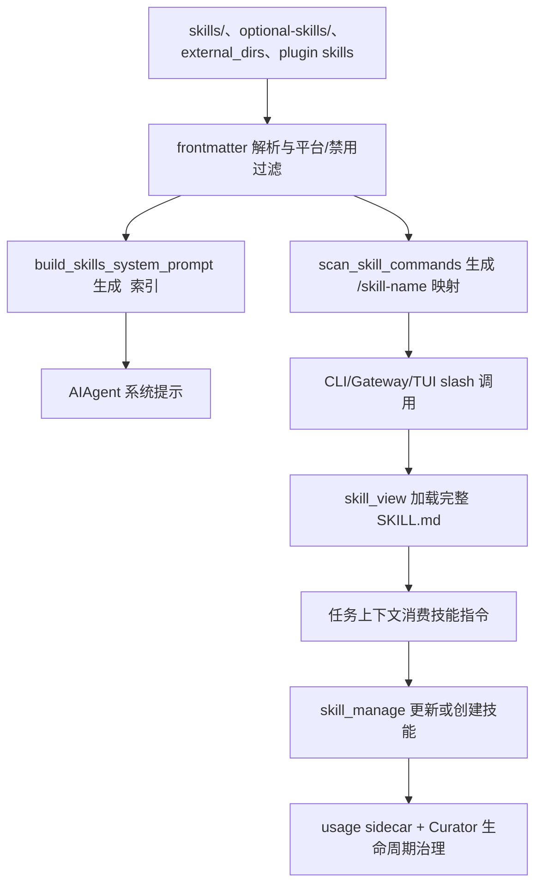

# Hermes Agent Skill 系统详细解析报告

## 1. 分析范围

本文基于 `Analysis-Report/02-核心机制/02-Skills体系/Skills体系涉及文件清单.md` 中列出的实现文件阅读源码后整理，重点覆盖 Skill 的资产结构、发现加载、工具接口、安装同步、安全边界、入口集成和 Curator 生命周期。

本次按要求忽略 `.git`、工程配置、测试文件，以及大量具体技能文件。仅抽样查看了一个技能 `skills/research/arxiv/SKILL.md` 的开头作为格式例子。

## 2. 总体定位

Hermes 的 Skill 系统本质上是“可演进的过程性 Prompt 资产层”。它不把某类任务的最佳实践硬编码到 `run_agent.py` 或工具实现里，而是把它们沉淀为可扫描、可加载、可修改、可安装、可归档的 `SKILL.md` 文档和支持文件。

从职责上看，Skill 同时承担四个角色：

1. **轻量知识索引**：系统提示只放技能名称、分类和短描述，降低默认上下文成本。
2. **按需指令注入**：真正执行任务时通过 `/skill-name`、`skill_view()`、`--skills` 或 Cron 附加技能，把完整 `SKILL.md` 注入当前任务上下文。
3. **过程性记忆**：复杂任务经验可以通过 `skill_manage()` 写回技能库，用于下一次复用。
4. **可治理资产**：通过 Skills Hub、安全扫描、使用统计、Curator 和备份回滚维护技能生命周期。

核心链路可以概括为：



## 3. 技能资产模型

### 3.1 存储位置

`hermes_constants.py` 定义了 profile-aware 路径：

- `get_skills_dir()` 返回当前 profile 下的 `~/.hermes/skills`。
- `get_optional_skills_dir()` 支持 `HERMES_OPTIONAL_SKILLS` 覆盖，否则使用打包或 profile 的 `optional-skills`。

运行时的单一技能安装目录是 `~/.hermes/skills/`。仓库内置 `skills/` 通过 `tools/skills_sync.py` 同步到 profile 目录；agent 新建、hub 安装、用户放入的技能都在这个 profile 目录下共存。

### 3.2 标准目录结构

`tools/skills_tool.py` 对 Skill 的结构定义是：

```text
skill-name/
  SKILL.md
  references/
  templates/
  scripts/
  assets/
```

其中 `SKILL.md` 是必需入口，其余目录按需提供长文档、模板、脚本和资产。`skill_view(name)` 首次加载主文件时会返回 `linked_files`，提示模型按需再次调用 `skill_view(name, file_path)` 读取支持文件。

### 3.3 SKILL.md frontmatter

抽样查看的 `skills/research/arxiv/SKILL.md` 使用如下字段：

```yaml
---
name: arxiv
description: "Search arXiv papers by keyword, author, category, or ID."
version: 1.0.0
author: Hermes Agent
license: MIT
metadata:
  hermes:
    tags: [Research, Arxiv, Papers, Academic, Science, API]
    related_skills: [ocr-and-documents]
---
```

系统重点读取：

- `name`：技能名，也是 slash 命令和查找的主要标识。
- `description`：系统提示和列表中的短描述。
- `platforms`：限制 `macos`、`linux`、`windows`。
- `metadata.hermes.tags`、`related_skills`：列表和文档辅助信息。
- `metadata.hermes.config`：声明技能需要的配置项。
- `required_environment_variables` / `setup.collect_secrets`：声明运行所需环境变量。
- `required_credential_files`：声明远端执行环境需要挂载的凭据文件。

## 4. 发现与索引机制

### 4.1 轻量公共解析层

`agent/skill_utils.py` 是核心轻量工具模块，刻意避免导入工具注册表、CLI 配置或 provider 解析链。它提供：

- `parse_frontmatter()`：解析 YAML frontmatter，失败时退化为简单 `key:value`。
- `skill_matches_platform()`：按当前 `sys.platform` 过滤技能。
- `get_disabled_skill_names()`：读取 `skills.disabled` 和 `skills.platform_disabled`。
- `get_external_skills_dirs()`：读取并规范化 `skills.external_dirs`。
- `iter_skill_index_files()`：递归扫描 `SKILL.md` 或 `DESCRIPTION.md`，排除 `.git`、`.github`、`.hub`、`.archive`。
- `extract_skill_conditions()`：读取 `requires_tools`、`requires_toolsets`、`fallback_for_tools`、`fallback_for_toolsets` 等条件。

这个模块是避免循环依赖的关键：prompt builder、skills tool、slash command 都能安全复用它。

### 4.2 系统提示索引

`agent/prompt_builder.py::build_skills_system_prompt()` 负责生成系统提示里的 `## Skills (mandatory)` 块。它只放分类、名称和短描述，不放完整技能内容。

它有两层缓存：

1. 进程内 LRU 缓存，key 包含本地 skills 路径、external dirs、可用 tools/toolsets、平台、禁用列表。
2. 磁盘快照 `~/.hermes/.skills_prompt_snapshot.json`，用 `SKILL.md` 和 `DESCRIPTION.md` 的 mtime/size manifest 校验。

本地 skills 会写入快照，external dirs 每次直接扫描。名字冲突时，本地技能优先，外部目录技能跳过。

索引构建时会过滤：

- 当前 OS 不兼容的技能。
- 全局或平台禁用的技能。
- 当前工具集合不满足 `requires_*` 的技能。
- 当前工具集合已具备目标能力时的 `fallback_for_*` 技能。

最终提示明确要求：任务相关时必须先用 `skill_view(name)` 加载技能；Hermes 自身问题优先加载 `hermes-agent`；发现技能问题时用 `skill_manage(action='patch')` 修复。

### 4.3 Agent 系统提示接入

`run_agent.py` 的系统提示构造顺序中，Skill 位于记忆之后、项目上下文文件之前。只有当前 agent 可用工具里包含 `skills_list`、`skill_view` 或 `skill_manage` 时，才会调用 `build_skills_system_prompt()`。

这使 Skill 系统是 toolset 驱动的：工具不可用时，不注入 Skill 索引，也不会要求模型加载技能。

## 5. Slash 技能调用

### 5.1 动态命令发现

`agent/skill_commands.py::scan_skill_commands()` 扫描本地 `~/.hermes/skills/` 和 `skills.external_dirs`，把每个可用技能映射成 `/skill-name`：

- 技能名小写。
- 空格和下划线转成 hyphen。
- 删除 Telegram 等平台不接受的特殊字符。
- 本地目录优先，重复技能名跳过。
- 遵守平台兼容和禁用配置。

缓存中记录 `name`、`description`、`skill_md_path`、`skill_dir`。

### 5.2 调用消息构造

`build_skill_invocation_message()` 会：

1. 通过 `skill_view(..., preprocess=False)` 读取技能。
2. 记录 `bump_use()`。
3. 生成一个带有重要标记的消息块，说明用户显式调用了该技能。
4. 调用 `_build_skill_message()` 注入完整内容、技能目录、配置值、setup 提示和支持文件列表。

这条路径把 Skill 作为“用户侧增强输入”送进会话，而不是静默修改系统提示。好处是消息来源清晰，也保持 provider 的消息交替规则。

### 5.3 预加载技能

`build_preloaded_skills_prompt()` 用于 CLI/TUI 启动参数 `--skills`。它和 slash 调用类似，但激活语义是“本 session 持续生效”，会把结果拼到启动时的 `system_prompt` 中。

## 6. 技能内容预处理

`agent/skill_preprocessing.py` 对 `SKILL.md` 支持两类预处理：

- 模板变量：`${HERMES_SKILL_DIR}`、`${HERMES_SESSION_ID}`。
- inline shell：`!` 反引号命令片段，由配置 `skills.inline_shell` 控制。

默认 `template_vars=True`，`inline_shell=False`。inline shell 会用 skill 目录作为 cwd 执行 `bash -c`，输出限制 4000 字符，超时默认 10 秒。

这个设计允许技能引用自身脚本或注入动态上下文，但 inline shell 是高风险能力，所以默认关闭，并在 `hermes_cli/config.py` 注释中明确只应对可信技能源开启。

## 7. Agent 工具接口

### 7.1 Toolset 暴露

`toolsets.py` 把三个 Skill 工具放入核心工具列表和独立 `skills` toolset：

- `skills_list`
- `skill_view`
- `skill_manage`

`model_tools.py` 的 legacy 映射也把 `skills_tools` 映射到这三个工具，兼容旧配置。

### 7.2 skills_list：低成本目录

`tools/skills_tool.py::skills_list()` 返回 JSON：

- `skills`: 每项只有 `name`、`description`、`category`。
- `categories`: 可用分类列表。
- `count` 和提示信息。

它使用 `_find_all_skills()`，扫描本地和 external dirs，读取 `SKILL.md` 前 4000 字符用于 frontmatter 和首段描述提取。

### 7.3 skill_view：按需加载完整技能

`skill_view(name, file_path=None)` 是核心加载器，支持：

- 直接路径：如 `mlops/axolotl`。
- 按目录名扫描：如 `axolotl`。
- legacy flat `.md` 文件。
- 插件命名空间：如 `plugin:skill`。
- 支持文件读取：如 `references/api.md`。

安全边界包括：

- `file_path` 禁止 `..`，并用 `validate_within_dir()` 确保不逃逸技能目录。
- 对不在可信 skills 目录或 external dirs 内的文件记录 warning。
- 检测常见 prompt injection 字样并记录 warning，但本地技能仍会返回内容。
- 平台不兼容或技能禁用时直接拒绝。

加载主技能时，`skill_view()` 会：

- 返回 tags、related_skills、linked_files。
- 检查 `required_environment_variables` 和 legacy `prerequisites.env_vars`。
- 在 CLI/TUI 支持时触发 secret capture。
- 将已经存在的技能声明环境变量注册到 `tools.env_passthrough`。
- 注册 `required_credential_files`，供 Docker/Modal 等远端环境挂载。
- 根据缺失依赖返回 `setup_needed`、`setup_note` 和 `readiness_status`。

工具注册层 `_skill_view_with_bump()` 会在成功加载后 best-effort 调用 `bump_view()` 和 `bump_use()`。

### 7.4 skill_manage：过程性记忆写回

`tools/skill_manager_tool.py::skill_manage()` 支持：

- `create`：新建技能目录和 `SKILL.md`。
- `edit`：完整替换 `SKILL.md`。
- `patch`：对 `SKILL.md` 或支持文件做模糊 find-and-replace。
- `delete`：删除技能。
- `write_file`：写入支持文件。
- `remove_file`：移除支持文件。

关键校验：

- 技能名和分类必须是安全的单段路径。
- `SKILL.md` 必须有 frontmatter，并包含 `name` 和 `description`。
- `SKILL.md` 内容上限 100000 字符。
- 支持文件必须位于 `references/`、`templates/`、`scripts/`、`assets/` 下。
- 支持文件大小上限 1 MiB。
- 支持文件路径禁止 traversal。
- pinned 技能拒绝 `delete`，但允许 patch/edit。

成功修改后会清理 Skill 系统提示缓存和磁盘快照，使新技能能进入后续索引。它还会更新 usage sidecar：

- `create` 且当前写入来源为 background review 时，标记 agent-created。
- `patch/edit/write_file/remove_file` 时 bump patch。
- `delete` 时 forget usage。

注意：`delete` 的实现语义是删除整个技能目录；Curator 的自动治理不会直接删除，而是归档。

## 8. 内置技能同步

`tools/skills_sync.py` 负责把仓库内置 `skills/` 同步到 `~/.hermes/skills/`。它维护 `~/.hermes/skills/.bundled_manifest`，manifest v2 格式是：

```text
skill_name:origin_hash
```

同步策略：

- 新内置技能：复制到用户 skills 目录并写入 manifest。
- 用户未修改、上游变更：自动更新。
- 用户修改过：跳过，不覆盖用户内容。
- 用户删除过：尊重删除，不重新添加。
- 上游移除：清理 manifest 项。
- `DESCRIPTION.md` 会补充复制到分类目录。

CLI 启动、gateway 启动、更新流程和 profile 初始化都会触发同步。

## 9. Skills Hub 安装体系

`tools/skills_hub.py` 是库模块，CLI/TUI slash 命令通过 `hermes_cli/skills_hub.py` 调用它。核心抽象是 `SkillSource`：

- `search(query, limit)`
- `fetch(identifier)`
- `inspect(identifier)`
- `source_id()`
- `trust_level_for(identifier)`

当前 source router 包含：

- `OptionalSkillSource`：官方 `optional-skills/`。
- `HermesIndexSource`：集中索引。
- `SkillsShSource`
- `WellKnownSkillSource`
- `UrlSource`
- `GitHubSource`
- `ClawHubSource`
- `ClaudeMarketplaceSource`
- `LobeHubSource`

`OptionalSkillSource` 把 repo 的 `optional-skills/` 暴露为 `official/...`，trust level 是 `builtin`，不会默认激活，用户通过 Hub 安装后才复制到 `~/.hermes/skills/`。

### 9.1 安装流程

`hermes_cli/skills_hub.py::do_install()` 的主流程：

1. 根据 identifier 选择 source。
2. fetch 成 `SkillBundle`。
3. URL 来源缺少 name 时要求显式 `--name` 或交互输入。
4. official 来源自动从 identifier 推导 category。
5. 写入 `.hub/quarantine/<skill>`。
6. 调用 `scan_skill()` 安全扫描。
7. 根据 trust policy 决定 allow/block/force。
8. 交互确认。
9. 从 quarantine 移到 `~/.hermes/skills/<category>/<skill>`。
10. 写 `skills/.hub/lock.json` 和 `audit.log`。
11. 清理 Skill prompt cache。

### 9.2 安装状态记录

`HubLockFile` 记录：

- source
- identifier
- trust_level
- scan_verdict
- content_hash
- install_path
- files
- metadata
- installed_at / updated_at

这让 `hermes skills list/check/update/audit/uninstall` 能区分 hub、builtin 和 local 技能。

## 10. 安全模型

### 10.1 外部技能扫描

`tools/skills_guard.py` 对外部来源技能做静态扫描，覆盖：

- 文件结构、大小、二进制、symlink。
- secret exfiltration。
- prompt injection。
- destructive command。
- persistence。
- network 行为。
- obfuscation 和不可见字符。

trust level：

- `builtin`：内置或 official。
- `trusted`：`openai/skills`、`anthropics/skills`。
- `community`：其他来源。
- `agent-created`：agent 自己写的技能，在配置开启时扫描。

策略矩阵：

| trust level | safe | caution | dangerous |
| --- | --- | --- | --- |
| builtin | allow | allow | allow |
| trusted | allow | allow | block |
| community | allow | block | block |
| agent-created | allow | allow | ask |

外部 Hub 安装总会扫描；agent 通过 `skill_manage` 创建/修改的技能只有在 `skills.guard_agent_created=true` 时扫描。

### 10.2 环境变量透传

`tools/env_passthrough.py` 解决技能运行脚本时所需环境变量被 sandbox 清理的问题。`skill_view()` 读取 `required_environment_variables` 后，会把已存在的变量注册到 session-scoped allowlist。

重要限制：Hermes provider 凭据在 `_HERMES_PROVIDER_ENV_BLOCKLIST` 中，技能不能把 `OPENAI_API_KEY`、`ANTHROPIC_TOKEN` 等主模型凭据注册为 passthrough。这是为了避免恶意技能绕过执行沙箱的凭据清理。

### 10.3 Cron 运行时二次扫描

Cron 任务可以附加 skills。`cron/scheduler.py::_build_job_prompt()` 会在运行前逐个 `skill_view()`，把技能内容拼到最终 prompt。随后 `_scan_assembled_cron_prompt()` 对“用户 prompt + skill 内容”整体做 prompt injection 扫描。

这是必要的，因为 Cron 非交互运行且可能自动批准工具调用；仅在创建任务时扫描用户 prompt 不足以覆盖运行时加载的技能内容。

## 11. 插件技能

`hermes_cli/plugins.py::PluginContext.register_skill()` 允许插件注册只读技能：

```text
<plugin_name>:<skill_name>
```

插件技能特征：

- 不进入 `~/.hermes/skills/`。
- 不出现在系统提示 `<available_skills>` 索引中。
- 必须用 qualified name 显式 `skill_view("plugin:skill")`。
- `skill_view()` 会附加 bundle context，提示同插件的 sibling skills。
- 插件禁用时，插件技能也不可用。

这种设计避免插件技能污染普通技能目录，也避免系统提示默认膨胀。

## 12. CLI / Gateway / TUI / Dashboard 集成

### 12.1 CLI

`cli.py` 在启动时扫描 slash skill commands，并支持：

- `/skill-name` 动态技能调用。
- `/skills ...` 委托给 `hermes_cli.skills_hub`。
- `/reload-skills` 重新扫描技能命令。
- `--skills` 启动预加载。
- Cron 子命令中的 `--skills`、`--add-skills`、`--remove-skills`、`--clear-skills`。

`/reload-skills` 特别注意不清理系统提示缓存。它只刷新 slash command 映射，并把 added/removed diff 排成一个 one-shot note，等下一次用户消息时 prepend 给模型。

### 12.2 Gateway

`gateway/run.py` 复用 `agent.skill_commands`：

- 平台消息中的 `/skill-name` 会构造技能消息并落入正常 agent turn。
- 平台级禁用会在执行前二次检查。
- `/reload-skills` 会刷新内存映射，并调用 adapter 的 `refresh_skill_group()`。
- 新 session 可根据 `MessageEvent.auto_skill` 自动注入一个或多个技能。
- gateway 启动时会同步内置技能。

`gateway/platforms/base.py::resolve_channel_skills()` 支持 `channel_skill_bindings`，按 channel/thread id 自动绑定技能。Discord 和 Slack adapter 会把解析结果放入 `MessageEvent.auto_skill`。

### 12.3 Discord 特化

Discord 使用单个 `/skill` 命令和 autocomplete，而不是为每个技能注册一个 slash 命令。原因是 Discord slash command payload 有大小限制；flat autocomplete 可以随着技能数量增长而不膨胀注册 payload。

`/reload-skills` 后，Discord adapter 的 `refresh_skill_group()` 重新扫描本地技能并更新 autocomplete 内存状态。

### 12.4 TUI

`tui_gateway/server.py` 暴露：

- `skills.manage`
- `skills.reload`

TUI 启动可从环境读取预加载技能，调用 `build_preloaded_skills_prompt()` 拼入系统提示。slash dispatch 发现技能命令时返回 `{type: "skill", message, name}`，前端再把 message 发送到会话。

`ui-tui/src/components/skillsHub.tsx` 提供 TUI 内置 Skills Hub 列表、inspect、install 操作。

### 12.5 Dashboard

`hermes_cli/web_server.py` 提供：

- `GET /api/skills`：返回所有技能并标注 `enabled`。
- `PUT /api/skills/toggle`：写入 enabled/disabled 状态。

`web/src/pages/SkillsPage.tsx` 是前端技能管理页，负责搜索、分类和启用/禁用。

## 13. Cron 与任务系统

`cron/jobs.py` 规范化 `skill` 和 `skills` 字段，保留 legacy 单技能字段，同时以 `skills` 列表为规范形态。

`cron/scheduler.py` 运行时加载技能：

1. 读取 job 的 `skills`，兼容 legacy `skill`。
2. 对每个技能调用 `skill_view()`。
3. 成功时 bump use。
4. 将完整技能内容拼入 prompt。
5. 找不到技能时加入提示，要求最终回复开头告知用户。
6. 对完整 assembled prompt 做注入扫描。

Curator 合并或归档技能后，`cron.jobs.rewrite_skill_refs()` 可以重写 Cron job 中的技能引用：合并到 umbrella 的技能替换为新技能，真正 pruning 的技能从列表中移除。

## 14. Curator 生命周期治理

Skill 的生命周期治理由三部分组成：

- `tools/skill_usage.py`：使用统计和状态 sidecar。
- `tools/skill_provenance.py`：写入来源 ContextVar。
- `agent/curator.py` / `agent/curator_backup.py`：后台维护、归档和回滚。

### 14.1 Usage sidecar

`.usage.json` 位于 `~/.hermes/skills/.usage.json`，记录：

- `use_count`
- `view_count`
- `patch_count`
- `last_used_at`
- `last_viewed_at`
- `last_patched_at`
- `created_by`
- `state`
- `pinned`
- `archived_at`

设计上它是 sidecar，不写进 `SKILL.md`，避免污染用户内容或制造上游同步冲突。

### 14.2 Provenance

`tools/skill_provenance.py` 用 `ContextVar` 区分前台用户请求和后台 review fork。`run_agent.py` 每次 conversation 开始会设置当前 write origin；后台 review agent 会设置为 `background_review`。

只有在 background review fork 中 `skill_manage(action="create")` 的技能，才会通过 `mark_agent_created()` 标记为 Curator 管理对象。用户前台要求创建的技能归用户所有，不会自动治理。

需要注意命名细节：`skill_usage.is_agent_created()` 在一些路径里实际表示“不是 bundled/hub installed”，而真正进入 Curator 管理还需要 `.usage.json` 中 `created_by=agent` 或 `agent_created=true`。

### 14.3 自动状态迁移

`agent/curator.py::apply_automatic_transitions()` 按配置执行：

- `stale_after_days` 后标记 stale。
- `archive_after_days` 后归档到 `.archive/`。
- pinned 技能跳过所有自动迁移。
- 最近有活动的 stale 技能可恢复 active。

默认配置中：

- Curator enabled。
- interval 7 天。
- min idle 2 小时。
- stale 30 天。
- archive 90 天。
- backup 保留 5 个快照。

### 14.4 LLM 维护 pass

Curator 会在需要时 fork 一个辅助 agent，使用 `skills` toolset 做治理。它的目标不是制造大量细粒度技能，而是把经验合并成 class-level umbrella skills。

核心不变量：

- 不碰 bundled 或 hub-installed skills。
- 不自动删除，只归档。
- pinned 技能完全跳过。
- 合并时必须声明 `absorbed_into`，便于 Cron 引用迁移。
- 运行前用 `curator_backup.snapshot_skills()` 建立快照。

## 15. 与 Memory 的边界

源码注释中反复强调：

- Memory 记录“用户是谁、偏好是什么、事实是什么”。
- Skill 记录“这类任务该怎么做、步骤是什么、坑在哪里、如何验证”。

`run_agent.py` 的后台 review prompt 会同时考虑 memory 和 skill，但写入路径不同。复杂任务、用户纠错、反复迭代出的 workflow、错误修复经验，都应优先进入 Skill。

## 16. 关键设计取舍

### 16.1 渐进式披露降低上下文成本

默认系统提示只含短索引，不含完整技能。这能让几十到上百个技能可见，而不会把上下文耗尽。模型需要时再 `skill_view()`。

### 16.2 reload 不破坏 prompt cache

`/reload-skills` 不清理系统提示缓存，只刷新 slash command 映射并在下一轮塞入 diff note。这样新增技能即使尚未进入 cached system prompt，也可通过 slash 或 `skills_list` 使用。

Hub 安装和 `skill_manage` 修改则会清理缓存，因为资产内容确实发生变化，需要后续索引更新。

### 16.3 本地优先，外部只读

`skills.external_dirs` 便于团队共享技能，但创建新技能始终写入本地 profile skills。索引冲突时本地优先，降低外部共享目录覆盖个人技能的风险。

### 16.4 插件技能显式加载

插件技能不进全局索引，必须 `plugin:skill` 显式访问。这让插件能提供专有技能，又不让默认 prompt 规模失控。

### 16.5 Curator 只治理 agent-created

通过 provenance 和 usage sidecar，系统避免误动用户手写、内置或 hub 安装技能。这个边界是 Skill 生命周期治理能自动运行的前提。

## 17. 主要风险点

1. **技能内容本身是 prompt 权限面**：本地技能被视为可信，prompt injection 只记录 warning，不阻止加载。
2. **inline shell 风险高**：开启后技能作者的命令会在主机执行，因此默认关闭。
3. **外部技能安装依赖静态扫描**：regex 扫描只能覆盖已知模式，community 来源仍需要人工审阅。
4. **`skill_manage delete` 是目录级删除能力**：虽然有 pinned 和 Curator 归档策略，但前台工具调用仍可删除技能目录，使用时应要求明确意图。
5. **环境变量透传需要谨慎**：系统已阻断 Hermes provider credential，但第三方 API key 仍会按技能声明进入沙箱。
6. **缓存一致性依赖清理点**：`skill_manage` 和 Hub 安装会清缓存；直接手工改文件后需要 `/reload-skills` 或进程重启/快照失效才能完全反映。

## 18. 一句话总结

Hermes 的 Skill 系统不是简单的“读取一堆 Markdown”，而是一套围绕 `SKILL.md` 建立的可发现、按需加载、可写回、可安装、可审计、可治理的过程性知识系统。它把 agent 的任务经验从一次性上下文升级为 profile 级资产，并通过工具、入口适配、安全扫描和 Curator 形成闭环。

## 19. Agent 如何自己创建一个技能

Hermes Agent 自己创建技能并不是直接调用通用文件写入工具，而是通过专门的 `skill_manage` 工具，把一次任务中沉淀出的可复用流程写成标准 `SKILL.md`。这个流程同时受系统提示、后台 review fork、工具参数校验、来源标记和 Curator 治理边界约束。

### 19.1 创建技能的触发来源

创建技能有两类来源。

第一类是前台用户意图驱动。只要当前 agent 暴露了 `skills` toolset，`skill_manage` 就会进入可调用工具列表。`run_agent.py` 在构建系统提示时检测到 `skill_manage` 后，会注入 `SKILLS_GUIDANCE`，要求 agent 在完成复杂任务、修复棘手错误、发现非平凡工作流后，把方法保存为 skill；如果使用已有 skill 时发现其过时、缺步骤或错误，则应立即 patch。

第二类是后台自改进 review。主对话结束后，`run_agent.py` 会根据工具调用迭代计数判断是否触发技能复盘。默认 `skills.creation_nudge_interval` 是 10，`_iters_since_skill` 会在每轮工具调用循环后递增；当计数达到阈值且 `skill_manage` 可用时，本轮最终回复交付后会启动后台 review。后台 review 是 best-effort，不阻塞用户主任务。

### 19.2 后台 review fork 的运行方式

后台 review 由 `AIAgent._spawn_background_review()` 创建一个新的静默 agent。这个 fork 继承父 agent 的运行时配置，包括 provider、model、base_url、api_key、api_mode 和 credential pool，并把 toolset 限制为 `memory` 与 `skills`，最大迭代数为 16。

fork 并不会修改主会话历史，也不会把完整复盘过程输出给用户。它把主会话消息作为 `conversation_history`，再追加 `_SKILL_REVIEW_PROMPT` 或 `_COMBINED_REVIEW_PROMPT` 作为新的用户消息。这个 review prompt 明确要求按以下优先级处理技能：

1. 优先 patch 本轮实际加载或查看过的 skill。
2. 如果已有 class-level umbrella skill 能覆盖本次经验，就 patch 该 umbrella。
3. 如果需要保存长细节、模板或脚本，就在已有 skill 下写入 `references/`、`templates/` 或 `scripts/` 支持文件，并在 `SKILL.md` 里加一行指针。
4. 只有在没有任何已有 skill 能覆盖该任务类别时，才创建新的 class-level umbrella skill。

这意味着 Hermes 的自动创建策略偏向“补强已有技能”，而不是把每次会话都变成一个细粒度新技能。

### 19.3 `skill_manage(action="create")` 的写入协议

真正创建动作发生在 `tools/skill_manager_tool.py::skill_manage()`。创建时模型必须调用：

```text
skill_manage(
  action="create",
  name="<skill-name>",
  category="<optional-category>",
  content="<完整 SKILL.md 文本>"
)
```

其中 `content` 必须是完整的 `SKILL.md`，包含 YAML frontmatter 和正文。工具层会强制校验：

- `name` 必须是文件系统安全名称，最长 64 字符，只允许小写字母、数字、点、下划线、连字符，并且必须以字母或数字开头。
- `category` 如果存在，也必须是单个安全目录名，不能包含 `/` 或 `\`。
- `SKILL.md` 必须以 `---` 开头，frontmatter 必须能被 YAML 解析。
- frontmatter 必须包含 `name` 和 `description`。
- `description` 最长 1024 字符。
- frontmatter 后必须有正文。
- 单个 `SKILL.md` 内容最长 100000 字符，过大内容应拆到支持文件。

校验通过后，工具会在所有技能目录中查重。查重使用 `_find_skill()`，扫描本地 `~/.hermes/skills/` 以及 `skills.external_dirs` 配置的外部技能目录。如果已存在同名 skill，创建会失败，避免覆盖已有资产。

### 19.4 落盘位置与目录结构

新建技能始终写入本地 profile 的 skills 目录，不写入外部共享目录：

```text
~/.hermes/skills/<name>/SKILL.md
~/.hermes/skills/<category>/<name>/SKILL.md
```

`_resolve_skill_dir()` 根据 `category` 决定最终目录。写入使用 `_atomic_write_text()`，先在同目录创建临时文件，再通过 `atomic_replace()` 替换目标文件，避免进程中断造成半写入的 `SKILL.md`。

创建成功后，工具返回相对路径、`SKILL.md` 路径，以及一个提示：如果还需要参考资料、模板或脚本，应继续用 `skill_manage(action="write_file")` 添加支持文件。

### 19.5 支持文件的追加方式

技能创建完成后，agent 可以继续调用：

```text
skill_manage(
  action="write_file",
  name="<skill-name>",
  file_path="references/example.md",
  file_content="..."
)
```

支持文件只能写在四类子目录下：

- `references/`
- `templates/`
- `scripts/`
- `assets/`

`_validate_file_path()` 会拒绝路径穿越，要求路径必须落在上述目录之一且必须包含文件名。`_resolve_skill_target()` 再用 `validate_within_dir()` 确保最终路径没有逃出 skill 目录。单个支持文件上限是 1 MiB。写入后同样会触发可选安全扫描，失败则回滚。

### 19.6 安全扫描与回滚

agent-created skill 的安全扫描由配置 `skills.guard_agent_created` 控制，默认关闭。源码注释给出的原因是：agent 本身已经可以通过 terminal 等工具执行同类路径，默认开启扫描会带来较多误拦截和摩擦。

如果用户开启该配置，`_security_scan_skill()` 会调用 `tools.skills_guard.scan_skill()` 扫描整个 skill 目录。扫描结论为 block 或 ask 时，工具会把错误返回给 agent：

- `create` 场景下，已经创建的 skill 目录会被回滚。
- `edit`、`patch`、`write_file` 场景下，会恢复原文件或移除新文件。

外部 Hub 安装来源的扫描策略更严格；agent 自己创建的技能默认不强制扫描。

### 19.7 来源标记：为什么有些技能会被 Curator 管，有些不会

Hermes 用 `tools/skill_provenance.py` 里的 `ContextVar` 区分技能写入来源。每次 `run_conversation()` 开始时，`run_agent.py` 会调用 `set_current_write_origin()`，默认来源是前台 `assistant_tool`。

后台 review fork 会显式设置：

```text
review_agent._memory_write_origin = "background_review"
review_agent._memory_write_context = "background_review"
```

随后工具处理成功时，`skill_manage()` 会执行来源判断：

- 如果 `action == "create"` 且 `is_background_review()` 为真，则调用 `mark_agent_created(name)`。
- `mark_agent_created()` 会在 `~/.hermes/skills/.usage.json` 中写入 `created_by: "agent"`。
- 如果是前台普通对话中的 `skill_manage(action="create")`，即使由 assistant 调用，也不会标记为 `created_by: "agent"`。

这个设计很关键：用户明确要求前台 agent 创建的技能被视为用户资产，不会被自动 Curator 治理；只有后台自改进 review fork 自主创建的技能才进入 agent-created 集合。

### 19.8 创建后的缓存与可发现性

`skill_manage()` 任意成功写操作都会调用 `clear_skills_system_prompt_cache(clear_snapshot=True)`。因此新技能写入后，后续系统提示快照和技能索引可以重新生成，不会长期使用旧的技能列表。

后续发现仍沿用常规 skill 发现机制：扫描 `SKILL.md`、解析 frontmatter、生成短索引，需要完整内容时再通过 `skill_view()` 加载。也就是说，创建技能只是把资产写入本地 profile；真正进入模型上下文仍遵循“索引先行、按需读取”的渐进式披露策略。

### 19.9 后续治理

被标记为 `created_by: "agent"` 的 skill 会被 `tools/skill_usage.py::list_agent_created_skill_names()` 枚举出来，供 Curator 使用。Curator 后续可以：

- 标记长期未使用 skill 为 stale。
- 将长期 stale 的 agent-created skill 归档到 `.archive/`。
- 合并过窄或重叠的技能到 umbrella skill。
- 在合并时用 `absorbed_into` 更新下游引用，例如 Cron job 的 skill 引用。

Curator 不会自动处理 bundled skill、Hub 安装 skill，也不会处理没有 `created_by: "agent"` 标记的用户前台创建 skill。这个边界避免了自动维护逻辑误动用户或上游维护的技能资产。

### 19.10 一句话概括

Hermes Agent 自己创建技能的闭环是：主任务产生可复用经验，系统提示或后台 review 判断值得沉淀，agent 通过 `skill_manage(action="create")` 写入标准 `SKILL.md`，工具层完成命名、frontmatter、大小、路径和可选安全校验，后台 review 创建的技能再被 `.usage.json` 标记为 `created_by: "agent"`，最后交给 Curator 做长期治理。

## 20. 相关源码阅读建议顺序

阅读 Skill 系统源码时，建议不要从具体 `skills/` 目录里的大量技能文件开始，而是先建立“入口如何发现技能、模型如何看到技能、工具如何读写技能、后台如何治理技能”的主线。下面顺序更容易把调用链串起来。

### 20.1 先读资产发现与索引

1. `agent/skill_utils.py`

   先看技能目录发现、`SKILL.md` 扫描、frontmatter 解析、本地目录与外部目录优先级、排除目录规则。这是理解“什么东西会被认定为 skill”的基础。

2. `agent/prompt_builder.py`

   再看技能索引如何进入系统提示，重点关注 `SKILLS_GUIDANCE`、技能快照、系统提示缓存、预加载技能 prompt。这里能解释为什么 Hermes 默认只暴露短索引，而不是一次性塞入所有技能全文。

3. `agent/skill_preprocessing.py`

   接着看技能内容进入上下文前如何处理模板变量、inline shell、路径变量等。这里决定 `SKILL.md` 最终呈现给模型的内容和源码文件本身可能不同。

### 20.2 再读用户入口

4. `agent/skill_commands.py`

   读 slash 技能命令的生成与分发逻辑，理解 `/skill-name` 为什么最终是把技能内容注入为用户消息，而不是改系统提示。

5. `cli.py`

   重点看 CLI 启动、slash command dispatch、`/reload-skills`、技能命令刷新与 prompt cache 的关系。不必通读全文件，只看与 skill/reload/command 相关的分支。

6. `gateway/run.py`、`gateway/platforms/base.py`

   看消息平台如何复用同一套 slash 技能入口，以及 gateway 对技能命令的适配方式。

7. `tui_gateway/server.py`、`hermes_cli/web_server.py`

   最后看 TUI 与 Dashboard 怎么展示、切换、安装和刷新技能。它们是 UI 集成层，不是核心语义层。

### 20.3 再读 Agent 工具接口

8. `tools/skills_tool.py`

   先读只读工具：`skills_list`、`skill_view`、技能内容加载、使用计数更新。这能说明 agent 如何按需查看完整 skill。

9. `tools/skill_manager_tool.py`

   然后读写工具：`skill_manage` 的 `create`、`patch`、`edit`、`delete`、`write_file`、`remove_file`。这是理解 agent 如何创建、修改、删除技能的核心文件。重点关注名称校验、frontmatter 校验、路径安全、原子写入、回滚、安全扫描和缓存清理。

10. `tools/path_security.py`、`tools/skills_guard.py`

   补读路径约束和安全扫描。前者解释为什么支持文件不能逃出 skill 目录；后者解释 Hub 安装和 agent-created skill 的风险检测差异。

### 20.4 再读自创建与后台复盘

11. `run_agent.py`

   不建议通读全文件。按关键词定位 `_SKILL_REVIEW_PROMPT`、`_COMBINED_REVIEW_PROMPT`、`_spawn_background_review()`、`_skill_nudge_interval`、`_iters_since_skill`、`set_current_write_origin()`、`skill_manage`。这条线能解释复杂任务结束后，为什么会触发后台复盘，以及复盘 agent 如何调用 `skill_manage`。

12. `tools/skill_provenance.py`

   读写入来源的 `ContextVar`。这里解释前台用户要求创建的 skill 与后台 review 自主创建的 skill 为什么会被区别对待。

13. `tools/skill_usage.py`

   读 `.usage.json` 的记录结构、`mark_agent_created()`、`bump_use()`、`bump_view()`、`bump_patch()` 和 `list_agent_created_skill_names()`。这里是 Skill 使用统计和 Curator 资格判断的边界。

### 20.5 再读安装、同步与治理

14. `tools/skills_sync.py`

   读内置技能如何同步到用户 profile，以及 bundled skill manifest 如何保护内置来源。

15. `tools/skills_hub.py`

   读官方可选技能、community/repo 安装、Hub lock、来源记录和安装扫描。这里解释 `optional-skills/` 与用户本地技能之间的关系。

16. `tools/skills_guard.py`

   如果前面只粗读过，这里再细读一次。Hub 安装路径依赖它做更严格的静态扫描。

17. `agent/curator.py`

   最后读 Curator。重点看 agent-created skill 列表输入、自动 stale/archive、LLM consolidation prompt、`absorbed_into`、Cron 引用迁移和备份流程。它是长期治理层，不是创建入口。

18. `agent/curator_backup.py`

   补读 Curator 运行前的快照机制，理解为什么治理动作可以回滚。

### 20.6 可选补读

- `cron/jobs.py`、`cron/scheduler.py`：看 scheduled job 如何引用和加载技能。
- `tools/skill_provenance.py` 与 `tools/skill_usage.py`：如果只关心 Curator 边界，这两个文件应反复对照读。
- `hermes_cli/plugins.py`：看插件技能和普通技能的边界。
- `toolsets.py`、`model_tools.py`：看 `skills` toolset 如何注册到 agent 工具列表。
- 一个具体 `skills/<category>/<name>/SKILL.md`：只抽样读一个即可，用来理解 frontmatter 与正文格式，不需要批量阅读技能库。

### 20.7 推荐最短阅读路径

如果只想快速理解 Skill 系统主干，按下面 8 个文件读即可：

1. `agent/skill_utils.py`
2. `agent/prompt_builder.py`
3. `tools/skills_tool.py`
4. `tools/skill_manager_tool.py`
5. `run_agent.py`
6. `tools/skill_provenance.py`
7. `tools/skill_usage.py`
8. `agent/curator.py`

这条路径能覆盖“发现、展示、按需读取、写回、自创建标记、使用统计、后台治理”的完整闭环。
