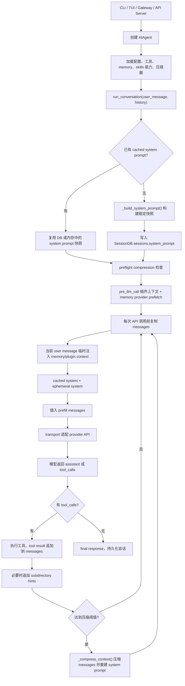
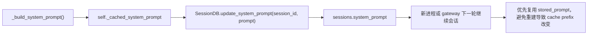
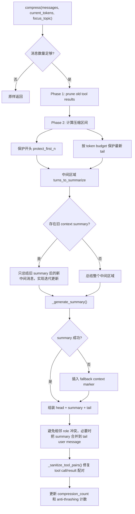
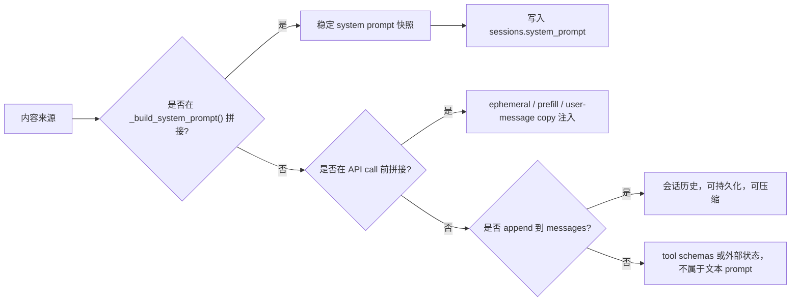
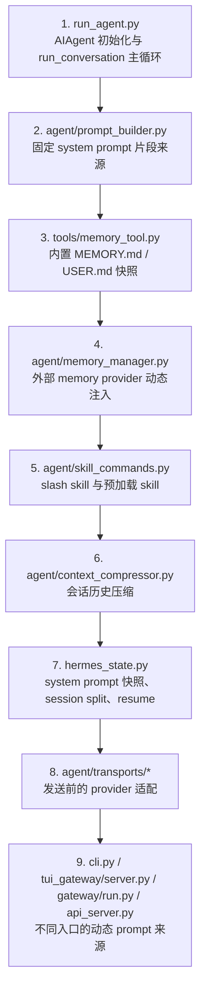

# Hermes Agent 运行时 Prompt 编排详细拆解报告

## 1. 核心结论

Hermes Agent 的运行时 prompt 不是单个模板，而是由五层数据在不同阶段组合出来：

1. **稳定 system prompt 快照**：由 `AIAgent._build_system_prompt()` 首轮构建，缓存在 `self._cached_system_prompt`，并写入 `SessionDB.sessions.system_prompt`。
2. **临时 system overlay**：`ephemeral_system_prompt` 在每次 API 调用前追加到稳定 system prompt 后面，不写入会话 DB。
3. **prefill messages**：few-shot 或上下文 priming 消息插在 system prompt 之后、会话历史之前，不持久化。
4. **会话消息链**：用户消息、assistant 消息、tool call、tool result，是主要增长和压缩对象。
5. **独立 tool schemas**：作为 API 参数 `tools` 传给模型，不拼入文本 system prompt。

整体设计目标是：**把低频变化内容固定成可复用前缀，把高频变化内容放到当前 user message、tool result 或 API-call-time overlay 中，从而提升 prompt cache 命中率。**

## 2. 推荐源码阅读顺序

按下面顺序阅读最容易理解运行时 prompt 的完整生命周期：

| 顺序 | 文件 | 重点 |
| --- | --- | --- |
| 1 | `run_agent.py` | `AIAgent.__init__()` 初始化工具、memory、压缩器；`run_conversation()` 组织每一轮消息；`_build_system_prompt()` 总装稳定 system prompt；`_compress_context()` 压缩后重建。 |
| 2 | `agent/prompt_builder.py` | 固定 prompt 的所有文本常量、skills 索引、项目规则文件、环境和平台 hint。 |
| 3 | `tools/memory_tool.py` | 内置 `MEMORY.md`、`USER.md` 如何加载为冻结 system prompt 快照。 |
| 4 | `agent/memory_manager.py`、`agent/memory_provider.py` | 外部 memory provider 的静态 system block、per-turn recall、压缩前生命周期 hook。 |
| 5 | `agent/skill_commands.py`、`agent/skill_preprocessing.py`、`tools/skills_tool.py` | slash skill、预加载 skill、`skill_view` 的注入方式。 |
| 6 | `agent/subdirectory_hints.py` | 工具访问新目录后如何把子目录规则追加到 tool result。 |
| 7 | `agent/transports/*.py` | Chat Completions、Codex Responses、Anthropic 等 API 边界如何改写 system/developer/instructions。 |
| 8 | `agent/context_compressor.py`、`agent/context_engine.py` | 哪些消息被压缩、如何生成 summary、如何保护头尾上下文。 |
| 9 | `cli.py`、`tui_gateway/server.py`、`gateway/run.py`、`gateway/platforms/api_server.py` | 不同入口如何传入 ephemeral prompt、prefill、平台上下文、skills 预加载。 |
| 10 | `hermes_state.py` | system prompt 快照如何持久化；压缩后 session lineage 如何追踪。 |

## 3. 总体运行流程



## 4. 固定部分：稳定 system prompt 快照

“固定”不是指永远不变，而是指**一个 session 内首轮构建后保持稳定**。后续轮次优先复用 `self._cached_system_prompt` 或 DB 中的 `sessions.system_prompt`，除非触发压缩、显式重置、模型或配置切换等使缓存失效的路径。

稳定 system prompt 由 `run_agent.py::_build_system_prompt()` 按顺序拼接：

| 顺序 | 来源 | 条件和说明 |
| --- | --- | --- |
| 1 | `SOUL.md` 或 `DEFAULT_AGENT_IDENTITY` | `load_soul_md()` 优先读取 `HERMES_HOME/SOUL.md` 作为身份层；没有则使用硬编码默认身份。若 `skip_context_files=True` 但 `load_soul_identity=True`，仍可加载 SOUL。 |
| 2 | `HERMES_AGENT_HELP_GUIDANCE` | 固定提示：用户问 Hermes 自身时应加载 `hermes-agent` skill。 |
| 3 | 工具相关 guidance | 取决于 `valid_tool_names`：memory、session_search、skills、kanban 对应不同 guidance。 |
| 4 | Nous subscription block | `build_nous_subscription_prompt()` 根据工具和订阅状态选择性加入。 |
| 5 | tool-use enforcement | 由 `agent.tool_use_enforcement` 和模型名控制；匹配 GPT/Codex/Gemini/Gemma/Grok 等模型时追加执行纪律。 |
| 6 | `system_message` 参数 | `run_conversation(system_message=...)` 传入时进入稳定 system prompt，并会随快照持久化。注意它不同于 `ephemeral_system_prompt`。 |
| 7 | 内置 memory 快照 | `MemoryStore.format_for_system_prompt("memory" / "user")` 返回 `load_from_disk()` 时冻结的 `MEMORY.md`、`USER.md` 快照。 |
| 8 | 外部 memory provider 静态 block | `MemoryManager.build_system_prompt()` 调用 provider 的 `system_prompt_block()`。 |
| 9 | skills 索引 | 当 `skills_list`、`skill_view` 或 `skill_manage` 可用时，`build_skills_system_prompt()` 生成 `<available_skills>` 索引。 |
| 10 | 项目上下文文件 | `build_context_files_prompt()` 按优先级只加载一种项目规则：`.hermes.md/HERMES.md`、`AGENTS.md`、`CLAUDE.md`、`.cursorrules/.cursor/rules/*.mdc`。 |
| 11 | 时间和身份信息 | conversation started 时间、session id、model、provider。 |
| 12 | provider 特例 | 例如 Alibaba provider 额外写入真实模型身份。 |
| 13 | 环境 hint | `build_environment_hints()` 目前主要检测 WSL。 |
| 14 | 平台 hint | `PLATFORM_HINTS` 或 `gateway.platform_registry` 提供的平台格式规则。 |

### 固定层的缓存和持久化



关键点：

- `run_agent.py::run_conversation()` 在 `self._cached_system_prompt is None` 时才构建。
- gateway 每条消息可能创建新的 `AIAgent`，所以会从 `SessionDB` 读取旧快照，避免因内存或 skills 文件变化打破 Anthropic prefix cache。
- `ephemeral_system_prompt` 明确不进入 `_build_system_prompt()`，只在 API 调用前拼接。

## 5. 动态部分：运行时临时注入

动态部分通常不修改稳定 system prompt；它们进入当前 API 请求的临时消息副本，或作为普通会话消息进入 `messages`。

| 动态内容 | 注入位置 | 是否持久化 | 是否会被压缩 | 主要源码 |
| --- | --- | --- | --- | --- |
| `ephemeral_system_prompt` | API 调用前追加到 cached system 后面 | 否 | 否 | `run_agent.py`、`cli.py`、`gateway/run.py`、`tui_gateway/server.py`、`gateway/platforms/api_server.py` |
| `prefill_messages` | system 之后、history 之前 | 否 | 否 | `run_agent.py`、`cli.py`、`gateway/run.py` |
| 当前 user message | `messages` 尾部 | 是 | 是，进入历史后可被压缩 | `run_agent.py::run_conversation()` |
| conversation history | `messages` 初始内容 | 是 | 是 | `run_agent.py::run_conversation()` |
| tool call / tool result | 追加到 `messages` | 是 | 是，旧 tool result 会先被 pruning | `run_agent.py::_execute_tool_calls*()` |
| memory provider prefetch | 当前 user message 的 API 副本后追加 `<memory-context>` | 否 | 否 | `MemoryManager.prefetch_all()`、`build_memory_context_block()` |
| 插件 `pre_llm_call` context | 当前 user message 的 API 副本后追加 | 否 | 否 | `hermes_cli/plugins.py` hook，由 `run_agent.py` 调用 |
| slash skill 调用 | 构造成当前 user message 内容 | 是 | 是 | `agent/skill_commands.py`、`cli.py`、`gateway/run.py`、`tui_gateway/server.py` |
| 预加载 skills | 拼入 `ephemeral_system_prompt` | 否 | 否 | `build_preloaded_skills_prompt()`、CLI/TUI 启动逻辑 |
| `/reload-skills` note | 下一条 user message 前缀 | 是 | 是 | `cli.py`、`gateway/run.py` |
| model switch note | 下一条 user message 前缀 | 是 | 是 | `cli.py`、`gateway/run.py` |
| subdirectory hints | 追加到 tool result | 是 | 是 | `agent/subdirectory_hints.py` |

### API 调用前的最终消息形态

`run_agent.py` 在每次 API 调用前复制 `messages`，并只修改复制件：

```text
api_messages =
  [system: cached_system_prompt + ephemeral_system_prompt]
  + prefill_messages
  + copied conversation messages
      其中当前 user message 的 copy 会追加:
        - <memory-context>...</memory-context>
        - plugin pre_llm_call context

tools = self.tools
```

这意味着：

- memory provider recall 和插件上下文不会污染 session DB。
- prefill 不会进入历史，也不会被压缩。
- stable system prompt 前缀尽量不动，ephemeral overlay 只在请求边界出现。

## 6. 不同入口如何提供动态 prompt

| 入口 | 动态来源 | 说明 |
| --- | --- | --- |
| CLI | `HERMES_EPHEMERAL_SYSTEM_PROMPT` 优先，其次 `CLI_CONFIG["agent"]["system_prompt"]`；`agent.prefill_messages_file`；`--skills` 预加载；slash skill；reload/model switch note | `HermesCLI` 创建 `AIAgent` 时传入 `ephemeral_system_prompt` 和 `prefill_messages`。 |
| TUI | `agent.system_prompt`；启动 skills 预加载 | `tui_gateway/server.py::_make_agent()` 把 system prompt 和预加载 skill 内容拼成 `ephemeral_system_prompt`。当前代码未传入 prefill messages。 |
| Gateway | `context_prompt`、channel prompt、`HERMES_EPHEMERAL_SYSTEM_PROMPT` 或 `agent.system_prompt`；gateway slash skill；reload/model switch note；gateway prefill | `gateway/run.py` 把平台上下文、频道上下文、用户配置 prompt 合并成 `combined_ephemeral`。 |
| API Server | 请求中的 `system` messages | OpenAI-compatible `/chat/completions` 会把所有 system messages 合并为 `ephemeral_system_prompt`，并把 user/assistant 消息作为 history/current input。 |

源码注意点：

- CLI 的 prefill 读取 `agent.prefill_messages_file`。
- Gateway 的 `_load_prefill_messages()` 读取 `HERMES_PREFILL_MESSAGES_FILE`，否则读取 raw config 的顶层 `prefill_messages_file`。
- API Server 和 TUI 创建 agent 的路径中没有看到 prefill 注入。

## 7. API Transport 层如何处理 prompt

| transport | prompt 处理 |
| --- | --- |
| `agent/transports/chat_completions.py` | 大部分 provider 使用 OpenAI chat 格式。对 `gpt-5`、`codex` 模型，会在 API 边界把首条 `system` role 改成 `developer` role，内部仍保持 system 表示。 |
| `agent/transports/codex.py` | Codex Responses API 从首条 system message 提取 `instructions`，剩余 messages 转成 Responses input。若没有 system，则回退默认 identity。 |
| `agent/transports/anthropic.py` | 调用 Anthropic adapter，把 OpenAI messages 转为 Anthropic `system` + `messages` 结构，并处理 Anthropic tool schema。 |
| `agent/transports/bedrock.py` | Bedrock Converse adapter 在 `_build_api_kwargs()` 分支中接管消息和工具转换。 |

这一层只改变 provider 请求形态，不改变 Hermes 内部 `messages` 或 cached system prompt。

## 8. 哪些内容会被压缩

压缩目标是 `run_conversation()` 内部的 `messages` 列表，也就是会话消息链。

### 会被压缩或改写的内容

- 历史 user messages。
- assistant messages。
- assistant tool call metadata。
- tool results。
- slash skill 注入的完整 skill 内容，因为它作为 user message 进入消息链。
- `/reload-skills` note、model switch note，因为它们被 prepend 到 user message。
- subdirectory hints，因为它们被追加到 tool result。
- 压缩后追加的 todo snapshot，如果当前 todo store 有内容。

### 不会被压缩的内容

- `self._cached_system_prompt` 本身。
- `ephemeral_system_prompt`。
- `prefill_messages`。
- memory provider prefetch 和插件 `pre_llm_call` context，因为它们只改 API copy，不改原始 `messages`。
- tool schemas。
- `MEMORY.md`、`USER.md` 原文件。
- skills 索引缓存和 skills 源文件。

需要注意：`ContextCompressor.compress()` 内部有处理首条 `role=system` 的逻辑，但 Hermes 正常路径把 system prompt 放在 `active_system_prompt`，不放进 `messages`。因此常规压缩不会直接压缩 system prompt。

## 9. 压缩触发点

Hermes 有多条压缩触发路径：

| 触发点 | 位置 | 说明 |
| --- | --- | --- |
| preflight compression | `run_agent.py::run_conversation()` 进入主循环前 | 估算 `messages + system_prompt + tools` 的 token 数，超过 threshold 则先压缩，避免第一轮 API 直接爆上下文。 |
| tool loop 后压缩 | 成功 API 调用并执行 tool calls 后 | 使用 provider 返回的 `prompt_tokens`；若没有 usage，则粗估 `messages + tools`。超过 threshold 时压缩。 |
| context error 驱动 | API 错误处理分支 | 对 413、context length exceeded、Anthropic long-context tier 等错误，先压缩再重试。最多若干次，避免无限循环。 |
| 手动 `/compress` | CLI 和 Gateway 命令 | 用户可指定 focus topic；最终调用 `_compress_context()`。 |
| Gateway session hygiene | `gateway/run.py` | 长生命周期 gateway session 在 agent 启动前做保洁压缩；阈值更高，默认约 85% context 或 hard message limit。 |

默认压缩配置在 `run_agent.py::__init__()` 读取：

- `compression.enabled`：是否开启。
- `compression.threshold`：默认 0.50。
- `compression.target_ratio`：默认 0.20。
- `compression.protect_last_n`：默认 20。
- context length 来自模型元数据、provider 探测或配置覆盖。

## 10. 压缩算法拆解

`agent/context_compressor.py::ContextCompressor.compress()` 的核心流程：



关键行为：

- 压缩前先做 cheap pruning：旧 tool result 会替换成一行摘要或占位，重复 tool result 会去重。
- 头部和尾部被保护，中间历史被总结。
- 如果已经有先前的 context summary，再次压缩会尝试迭代更新，而不是从零开始总结全部历史。
- summary 生成失败时不会静默丢上下文，而是插入 fallback marker，说明有消息被移除但无法总结。
- 压缩后会清理 orphan tool call/result，避免 provider 因配对错误拒绝请求。
- 如果连续压缩节省不足，会触发 anti-thrashing，避免反复压缩却几乎不省 token。

## 11. 压缩后如何重新加载 prompt

`run_agent.py::_compress_context()` 是压缩后的恢复和 session 切换中心。

```mermaid
sequenceDiagram
    participant Loop as run_conversation loop
    participant Agent as AIAgent._compress_context
    participant CC as ContextCompressor
    participant Mem as MemoryStore/MemoryManager
    participant DB as SessionDB

    Loop->>Agent: _compress_context(messages, system_message)
    Agent->>Mem: memory_manager.on_pre_compress(messages)
    Agent->>CC: compress(messages, current_tokens, focus_topic)
    CC-->>Agent: compressed messages
    Agent->>Agent: append todo snapshot if present
    Agent->>Agent: _invalidate_system_prompt()
    Agent->>Mem: MemoryStore.load_from_disk()
    Agent->>Agent: _build_system_prompt(system_message)
    Agent->>DB: commit old memory/session effects
    Agent->>DB: end old session with end_reason='compression'
    Agent->>DB: create child session parent_session_id=old_session_id
    Agent->>DB: update_system_prompt(new_session_id, new_system_prompt)
    Agent->>Mem: memory_manager.on_session_switch(reset=false, reason='compression')
    Agent-->>Loop: compressed messages + new_system_prompt
```

具体动作：

1. 通知外部 memory provider：`self._memory_manager.on_pre_compress(messages)`。
2. 调用 `self.context_compressor.compress()` 得到压缩后的 `messages`。
3. 如果 todo store 有内容，把 todo snapshot 作为 user message 追加到压缩结果。
4. 调用 `_invalidate_system_prompt()`：
   - 清空 `self._cached_system_prompt`。
   - 重新 `MemoryStore.load_from_disk()`，让刚刚写入的内置 memory 可以进入新快照。
5. 重新调用 `_build_system_prompt(system_message)` 生成新的稳定 system prompt。
6. 对 session DB 做 split：
   - 旧 session `end_reason='compression'`。
   - 新 session id 作为 child session 创建，`parent_session_id=old_session_id`。
   - 新 session 写入新的 `system_prompt` 快照。
   - flush cursor 重置，后续会把压缩后的 messages 写入新 session。
7. 通知 context engine 和 memory provider session id 已因 compression 切换。
8. 重置 file read dedup，避免压缩后再次读文件只返回“未变化”摘要。

源码注意点：`MemoryManager.on_pre_compress()` 的接口文档说返回文本可用于 compression summary，但当前 `run_agent.py::_compress_context()` 调用后没有使用返回值，只是通知 provider。若 provider 需要确保信息进入压缩摘要，当前代码需要靠 side effect 或后续改造。

## 12. 压缩后的恢复和 resume

压缩会产生 session lineage：

```text
old_session(end_reason='compression')
  -> child_session(parent_session_id=old_session)
      -> next_child_session(...)
```

相关恢复逻辑：

- `hermes_state.py::get_compression_tip()` 沿着 `parent_session_id` 找到压缩链末端。
- `hermes_state.py::resolve_resume_session_id()` 在 resume 空的 compression root 时跳到真正持有消息的 child session。
- CLI 和 Gateway 的 resume/list 相关路径会调用这些 helper，避免用户继续到已经被压缩结束的父 session。

## 13. 固定和动态边界的判断规则

判断某段内容属于固定还是动态，可以看它是否进入 `self._cached_system_prompt`：



典型例子：

- `SOUL.md`：固定，因为进入 `_build_system_prompt()`。
- `agent.system_prompt`：动态 overlay，因为 CLI/TUI/Gateway 通常作为 `ephemeral_system_prompt` 传入。
- API Server 请求里的 system message：动态 overlay，因为转换成 `ephemeral_system_prompt`。
- `MEMORY.md` 首轮快照：固定；压缩后会重新加载并成为新固定快照。
- memory provider recall：动态，因为只追加到当前 user message 的 API copy。
- slash skill：动态会话内容，因为作为 user message 进入 `messages`。
- skills 索引：固定，因为进入 stable system prompt。
- `skill_view` 返回的 skill 全文：动态会话内容，因为它是 tool result。

## 14. 关键文件职责清单

| 文件 | 运行时 prompt 职责 |
| --- | --- |
| `run_agent.py` | 总控：构建 system prompt、合成 API messages、注入 dynamic context、执行 tool loop、触发和恢复 compression。 |
| `agent/prompt_builder.py` | 所有固定 guidance、skills index、context files、环境/platform hints。 |
| `tools/memory_tool.py` | 内置 memory 文件读写和冻结 system prompt 快照。实际目录为 `get_hermes_home() / "memories"` 下的 `MEMORY.md`、`USER.md`。 |
| `agent/memory_manager.py` | 外部 memory provider 的 system block、prefetch、tool schemas、session/compression 生命周期。 |
| `agent/memory_provider.py` | provider 接口契约：`system_prompt_block()`、`prefetch()`、`on_pre_compress()` 等。 |
| `agent/skill_commands.py` | slash skill 和预加载 skill 的消息构造。 |
| `agent/skill_preprocessing.py` | SKILL.md 模板变量和 inline shell 预处理。 |
| `tools/skills_tool.py` | `skill_view` 加载 skill 正文，作为 tool result 回到消息链。 |
| `agent/subdirectory_hints.py` | 工具访问新目录后延迟加载目录级规则文件。 |
| `agent/context_compressor.py` | 压缩算法、summary 生成、tool result pruning、tool pair 修复。 |
| `agent/context_engine.py` | 可替换 context engine 抽象。 |
| `agent/transports/chat_completions.py` | Chat Completions 请求形态和 `system` 到 `developer` 的边界改写。 |
| `agent/transports/codex.py` | Responses API `instructions` 提取。 |
| `agent/transports/anthropic.py` | Anthropic system/messages 分离。 |
| `cli.py` | CLI 入口的 ephemeral prompt、prefill、slash skills、manual compress。 |
| `tui_gateway/server.py` | TUI 入口的 ephemeral prompt 和 startup skills。 |
| `gateway/run.py` | Messaging gateway 的平台上下文、频道 prompt、agent cache、session hygiene compression。 |
| `gateway/platforms/api_server.py` | OpenAI-compatible API 中 system messages 到 ephemeral prompt 的转换。 |
| `hermes_state.py` | system prompt 快照存储、compression session chain、resume tip 解析。 |
| `hermes_cli/config.py` | 默认配置项来源，尤其是 `agent.system_prompt`、compression、memory、skills 等。 |
| `model_tools.py`、`toolsets.py`、`tools/registry.py` | 决定 `valid_tool_names` 和 `self.tools`，间接影响固定 guidance、skills 索引和最终 tool schemas。 |

## 15. 一句话模型

可以把 Hermes 的 prompt 编排理解为：

```text
稳定前缀 = 身份 + Hermes guidance + 工具 guidance + memory 快照 + skills 索引 + 项目规则 + 环境/平台信息

每次请求 = 稳定前缀 + 临时 system overlay + prefill + 会话历史 + 当前 user 的临时 recall/context + tools 参数

压缩 = 只压缩会话历史；压缩后重建稳定前缀，并把新快照绑定到 compression 子 session
```

## 16. 相关源码建议阅读顺序

如果目标是理解 Hermes Agent 运行时 prompt 的完整编排机制，建议按“核心闭环优先，入口分支靠后”的顺序阅读。这样能先建立一条稳定主线，再把 CLI、TUI、Gateway、API Server 的差异接到同一套模型上。



| 顺序 | 文件 | 阅读重点 | 读完应能回答的问题 |
| --- | --- | --- | --- |
| 1 | `run_agent.py` | `AIAgent.__init__()`、`_build_system_prompt()`、`run_conversation()`、`_compress_context()` | prompt 是在哪一层被拼出来的？system、ephemeral、prefill、history 的顺序是什么？压缩后为什么要重建 system prompt？ |
| 2 | `agent/prompt_builder.py` | `build_system_prompt()` 相关 helper、固定 guidance、context files、skills index、environment/platform hints | 固定 prompt 的每个片段来自哪里？哪些内容会进入可缓存的 system prompt 快照？ |
| 3 | `tools/memory_tool.py` | `MemoryStore`、`MemoryFile`、`build_system_prompt_block()`、memory 文件路径 | `MEMORY.md`、`USER.md` 如何进入固定 system prompt？压缩前写入的记忆为什么能在压缩后重新加载？ |
| 4 | `agent/memory_provider.py`、`agent/memory_manager.py` | provider ABC、`system_prompt_block()`、`prefetch()`、`on_pre_compress()`、`sync_turn()` | 外部 memory 哪些是固定 block，哪些是每轮临时 recall？哪些只进入 API copy 而不持久化？ |
| 5 | `agent/skill_commands.py`、`agent/skill_preprocessing.py`、`tools/skills_tool.py` | slash skill、startup skills、`skill_view`、模板变量和 inline shell 预处理 | skill 是作为 system overlay、user message，还是 tool result 进入上下文？为什么 slash skill 会被压缩？ |
| 6 | `agent/subdirectory_hints.py` | 延迟目录规则加载、工具访问目录后的 hint 构造 | `AGENTS.md` / `CLAUDE.md` 这类目录级规则什么时候动态进入会话历史？ |
| 7 | `agent/context_compressor.py` | preflight 压缩、tool result pruning、summary 生成、protected head/tail、tool pair 修复 | 实际被压缩的是哪部分消息？summary 如何替换旧历史？哪些消息被保护？ |
| 8 | `hermes_state.py` | `update_system_prompt()`、session 创建/结束、`parent_session_id`、`get_compression_tip()`、`resolve_resume_session_id()` | system prompt 快照如何持久化？压缩产生的父子 session 如何 resume 到正确位置？ |
| 9 | `agent/transports/chat_completions.py`、`agent/transports/codex.py`、`agent/transports/anthropic.py` | OpenAI Chat、Codex Responses、Anthropic 的请求改写 | 发送给不同 provider 前，system prompt 是否会变成 developer 或 instructions？ |
| 10 | `cli.py` | `agent.system_prompt`、`prefill_messages_file`、slash command、manual `/compress` | CLI 入口额外增加了哪些动态 prompt？哪些来自配置文件？ |
| 11 | `tui_gateway/server.py` | TUI agent 创建、startup skills、ephemeral prompt | TUI 和 CLI 在 prefill、startup skill 注入上有什么差异？ |
| 12 | `gateway/run.py`、`gateway/platforms/api_server.py` | platform context、channel prompt、OpenAI-compatible system messages 转换、session hygiene compression | Gateway 和 API Server 如何把平台上下文或请求 system message 转成运行时 overlay？ |
| 13 | `hermes_cli/config.py` | `DEFAULT_CONFIG` 中 `agent`、`compression`、`memory`、`skills` 相关配置 | 哪些 prompt 行为来自默认配置？用户配置如何改变动态注入和压缩策略？ |
| 14 | `model_tools.py`、`toolsets.py`、`tools/registry.py` | tool discovery、toolset 过滤、tool schemas | tool schema 为什么不属于文本 prompt？启用工具集如何间接影响 prompt guidance 和可调用工具？ |

推荐的实际阅读方式：

1. 先从 `run_agent.py::_build_system_prompt()` 和 `run_agent.py::run_conversation()` 画出消息拼接顺序，不要一开始陷入各入口细节。
2. 再读 `agent/prompt_builder.py`，把固定 system prompt 的来源逐个标到 `_build_system_prompt()` 的拼接位置上。
3. 接着读 memory 与 skill 相关文件，重点区分“进入稳定 system prompt”和“作为动态 user/tool 消息进入会话历史”。
4. 然后读 `agent/context_compressor.py` 与 `run_agent.py::_compress_context()`，确认压缩只处理会话消息链，固定 prompt 通过失效缓存和重建来刷新。
5. 最后读 transport 和入口文件，把 CLI、TUI、Gateway、API Server 的特殊注入都归类到 ephemeral、prefill、history 或 tool schemas 四类中。
