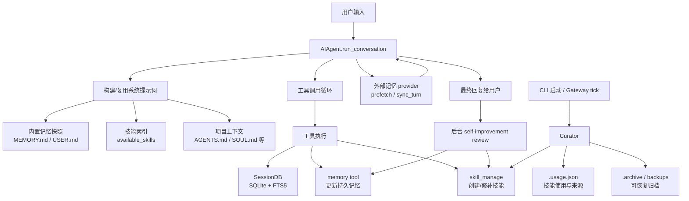
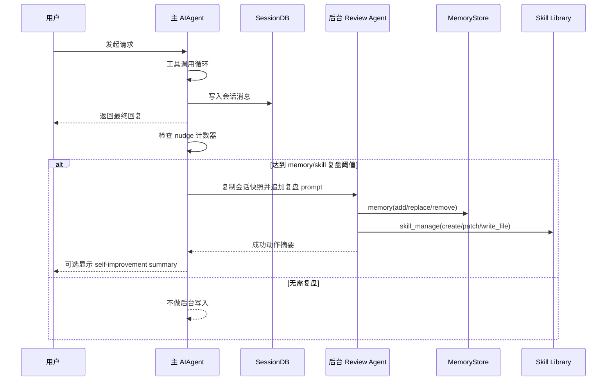
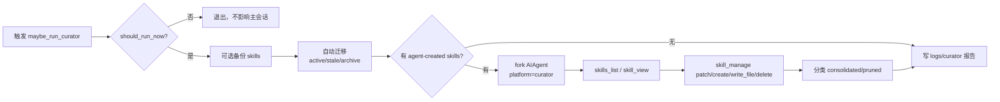

# Hermes Agent 如何实现 "The agent that grows with you"

> 阅读范围：本报告分析 Hermes Agent 源码中的成长机制；检索时忽略 `Analysis-Report/`、`.git/`、`.github/`、`.idea/` 等报告和工程配置目录。目录名按任务要求保留 `09-如何Rrows with you`。

## 结论概览

Hermes Agent 的 "grows with you" 不是通过训练模型权重实现的，而是在运行时构造了一个闭环学习系统：

1. **记住稳定事实**：用 `MEMORY.md` 和 `USER.md` 保存用户画像、环境事实、偏好和约定。
2. **召回完整历史**：所有会话写入 SQLite，并用 FTS5 / trigram FTS 做跨会话搜索，再由辅助模型总结。
3. **沉淀可复用流程**：把复杂任务中的有效步骤保存为 skill，作为程序性记忆。
4. **使用中自我修补**：技能被加载后，如果发现缺步骤、过时或错误，提示模型立即 patch。
5. **后台自我复盘**：主回复结束后，按 turn/工具迭代计数触发后台 review agent，专门更新 memory 和 skills。
6. **长期维护技能库**：curator 定期清理、归并、归档 agent-created skills，防止技能库无限膨胀。
7. **插件式扩展**：memory provider、context engine、plugin tools/hooks/skills 让能力随用户环境扩展。
8. **profile 隔离**：所有记忆、技能、日志、配置都走 `HERMES_HOME`，不同用户/身份可以独立成长。

对应产品文案在 `README.md:15` 和 `website/docs/index.md:12` 中明确写成 built-in learning loop：从经验创建技能、使用中改进、主动持久化知识、跨会话用户建模。

## 总体架构图

## 1. 成长的入口：默认工具面已经包含记忆、技能和历史搜索

`toolsets.py` 把 `skills_list`、`skill_view`、`skill_manage`、`memory`、`session_search` 放进 `_HERMES_CORE_TOOLS`，并把它们暴露到 `hermes-cli`、cron、Telegram、Discord 等默认平台工具集里（见 `toolsets.py:31`、`toolsets.py:41`、`toolsets.py:50`、`toolsets.py:52`、`toolsets.py:356`）。

这意味着成长能力不是外置示例，而是默认 agent loop 的一部分：

- `memory`：声明式长期记忆。
- `session_search`：完整会话库的检索型回忆。
- `skills_*`：程序性记忆的浏览、加载、创建和修补。

工具 schema 由 `model_tools.py` 统一发现、缓存和过滤。插件工具也通过同一套 registry/toolset 机制进入工具面，而不是绕过主流程（`model_tools.py:195`、`model_tools.py:271`、`model_tools.py:392`）。

## 2. 系统提示词：把成长结果注入下一次思考

`AIAgent._build_system_prompt()` 是成长结果进入模型上下文的汇合点（`run_agent.py:5114`）。它按层组装：

- agent identity / `SOUL.md`
- Hermes 自身帮助提示
- memory / session_search / skills 的行为指导
- 内置 memory 的冻结快照
- 外部 memory provider 的系统提示块
- skills 索引
- 项目上下文文件
- 日期、session、model、provider、平台提示

关键点：

- 内置 memory 通过 `format_for_system_prompt()` 进入系统提示词（`run_agent.py:5210`、`run_agent.py:5215`）。
- skills 索引用 `build_skills_system_prompt()` 生成并注入（`run_agent.py:5228`、`run_agent.py:5237`）。
- 会话继续时优先复用数据库里保存的 system prompt，避免中途重建导致 prompt cache 失效（`run_agent.py:10965` 起）。
- memory 的中途写入会落盘，但不会立刻改变本 session 的系统提示词，这保持 prefix cache 稳定。

这形成了一个延迟生效模式：**本轮学到的东西 durable，下一轮/下一会话成为模型先验**。

## 3. Declarative memory：小而硬的用户画像和环境事实

内置 memory 的实现集中在 `tools/memory_tool.py`。

### 存储模型

`MemoryStore` 管理两类文件（`tools/memory_tool.py:107`）：

- `MEMORY.md`：环境事实、项目约定、工具坑、经验教训。
- `USER.md`：用户是谁、偏好、沟通风格、期望。

条目用 `ENTRY_DELIMITER = "\n§\n"` 分隔（`tools/memory_tool.py:59`）。文件路径通过 `get_hermes_home() / "memories"` 动态解析，天然 profile-scoped。

### 有界与可维护

memory 不是无限追加日志：

- 默认限制来自 config：`memory_char_limit=2200`、`user_char_limit=1375`（`hermes_cli/config.py:979` 起）。
- `add()` 会在超限时拒绝写入，并把当前条目返回给模型，要求先替换或合并（`tools/memory_tool.py:224`、`tools/memory_tool.py:248`）。
- `replace()` 和 `remove()` 用唯一子串定位条目，避免模型处理 ID（`tools/memory_tool.py:269`、`tools/memory_tool.py:327`）。
- 写文件用临时文件 + atomic replace，读写并发用 lock 防护（`tools/memory_tool.py:442` 起）。
- 写入前扫描 prompt injection、密钥外传、不可见字符等风险，因为 memory 会被注入系统提示词（`tools/memory_tool.py:32` 起）。

### 工具 schema 本身就是策略

`MEMORY_SCHEMA` 明确告诉模型何时保存、保存到哪个 target、跳过什么内容（`tools/memory_tool.py:515`）。其中最重要的划分是：

- 用户偏好/身份：`target="user"`
- 环境/项目/工具经验：`target="memory"`
- 任务进度、临时 TODO、已完成工作日志：不要放 memory，交给 `session_search`
- 可复用流程：不要塞进 memory，应该变成 skill

## 4. External memory provider：更深的跨会话用户建模

内置 memory 是小而稳定的事实层；外部 memory provider 是可插拔的深层记忆层。

`agent/memory_provider.py` 定义统一接口（`agent/memory_provider.py:42`）：

- `initialize()`：按 session/profile/platform 初始化。
- `system_prompt_block()`：静态提示。
- `prefetch()`：每轮前召回相关上下文。
- `sync_turn()`：每轮后同步 user/assistant 交换。
- `on_session_end()`：会话结束抽取。
- `on_pre_compress()`：压缩前抽取。
- `on_memory_write()`：镜像内置 memory 写入。
- `on_delegation()`：记录子 agent 的结果。

`MemoryManager` 是 run_agent 的唯一集成点（`agent/memory_manager.py:190`）。它做三件事：

1. 注册 provider，并限制最多一个 external provider，避免工具 schema 膨胀和后端冲突。
2. 每轮前 `prefetch_all()`，把外部召回内容作为 fenced memory-context 注入（`agent/memory_manager.py:285`、`agent/memory_manager.py:173`）。
3. 每轮后 `sync_all()` 和 `queue_prefetch_all()`，把完成的交换写回外部后端并预热下一轮（`agent/memory_manager.py:317`、`run_agent.py:4954`、`run_agent.py:4958`）。

`StreamingContextScrubber` 会在流式输出里擦除 `<memory-context>`，避免内部召回上下文泄漏给用户（`agent/memory_manager.py:62`）。这说明外部记忆是给模型看的背景，不是用户回复内容。

provider 发现逻辑在 `plugins/memory/__init__.py`：内置 provider 和 `$HERMES_HOME/plugins/` 下的用户 provider 都可以被发现（`plugins/memory/__init__.py:67`、`plugins/memory/__init__.py:123`、`plugins/memory/__init__.py:160`）。

## 5. SessionDB + session_search：完整历史不是塞进 prompt，而是按需召回

Hermes 不把所有历史都放进长期 memory，而是把会话完整写入 SQLite。

`hermes_state.py` 的 `SessionDB` 创建：

- `sessions` 表保存来源、用户、模型、系统提示、父 session、token、标题等元数据。
- `messages` 表保存完整消息、tool calls、reasoning 等内容。
- `messages_fts` 用 FTS5 全文搜索。
- `messages_fts_trigram` 用 trigram tokenizer 支持 CJK/子串搜索。

相关位置：`hermes_state.py:104`、`hermes_state.py:133`、`hermes_state.py:159`。

主循环多次调用 `_persist_session()`，最终由 `_flush_messages_to_session_db()` 写入数据库（`run_agent.py:4001`）。`SessionDB.append_message()` 插入 messages 并更新 session 计数（`hermes_state.py:1266`）。

`tools/session_search_tool.py` 将这个数据库变成 agent 的长期回忆：

1. `db.search_messages()` 用 FTS5 找匹配消息（`tools/session_search_tool.py:366`）。
2. 按 session 聚合，跳过当前 lineage。
3. 加载完整会话 `get_messages_as_conversation()`（`tools/session_search_tool.py:438`）。
4. 围绕命中点截断，避免无关上下文占满 summarizer（`tools/session_search_tool.py:113`、`tools/session_search_tool.py:443`）。
5. 用辅助模型总结 top sessions（`tools/session_search_tool.py:198`、`tools/session_search_tool.py:461`）。

因此：

- memory 负责“应该总在脑中”的小事实。
- session_search 负责“过去发生过什么”的大历史。
- 这避免了长期运行后系统提示词膨胀，同时保留了可搜索的经验库。

## 6. Skills：把经验变成程序性记忆

skills 是 Hermes 的“会做事的记忆”。相关实现分三层。

### 6.1 索引与渐进披露

`agent/prompt_builder.py:718` 的 `build_skills_system_prompt()` 会扫描本地和外部技能目录，生成轻量 skills 索引。它只注入 name、description、category，而不把所有 `SKILL.md` 全文塞进系统提示词。

它还实现了：

- LRU 进程缓存与磁盘 snapshot（`agent/prompt_builder.py:573`、`agent/prompt_builder.py:584`、`agent/prompt_builder.py:597`）。
- 按平台、禁用项、可用 tools/toolsets 过滤技能（`agent/prompt_builder.py:687`）。
- 在系统提示词里要求模型遇到相关任务必须 `skill_view(name)` 加载全文（`agent/prompt_builder.py:914`）。

`tools/skills_tool.py` 负责 `skills_list` 和 `skill_view`。`skill_view` 成功时会 bump `view_count` 和 `use_count`，这为 curator 判断技能活跃度提供数据（`tools/skills_tool.py:1514` 起）。

### 6.2 skill_manage：创建、修补、支持文件和删除保护

`tools/skill_manager_tool.py` 是 agent 修改技能库的入口。

支持动作：

- `create`：创建新的 `SKILL.md`。
- `patch`：对 `SKILL.md` 或支持文件做局部替换。
- `edit`：完整重写。
- `write_file` / `remove_file`：维护 `references/`、`templates/`、`scripts/`、`assets/`。
- `delete`：删除/归档意图的工具动作。

关键实现：

- 技能名、category、frontmatter、内容大小都有校验（`tools/skill_manager_tool.py:373` 起）。
- 支持文件只能写到允许目录，防止路径逃逸（`tools/skill_manager_tool.py:171`、`tools/skill_manager_tool.py:315`）。
- patch 使用 fuzzy matching，降低模型精确字符串匹配失败率（`tools/skill_manager_tool.py:463` 起）。
- pinned skill 不能 delete，但仍允许 patch/edit 改进内容（`tools/skill_manager_tool.py:137`、`tools/skill_manager_tool.py:573`）。
- 成功写入后清理 skills prompt cache，并记录 usage telemetry（`tools/skill_manager_tool.py:778` 起）。

`SKILL_MANAGE_SCHEMA` 本身也在教模型什么时候创建或更新技能：复杂任务成功、克服错误、用户纠正工作流、发现非平凡流程、技能过时缺步骤时都要沉淀或修补（`tools/skill_manager_tool.py:797`）。

### 6.3 usage/provenance：只让可控技能进入维护闭环

`tools/skill_usage.py` 维护 `~/.hermes/skills/.usage.json`，记录：

- `use_count`
- `view_count`
- `patch_count`
- `last_used_at`
- `last_viewed_at`
- `last_patched_at`
- `state`: active / stale / archived
- `pinned`
- `created_by`

核心函数：`bump_view()`、`bump_use()`、`bump_patch()`、`mark_agent_created()`、`archive_skill()`、`restore_skill()`、`agent_created_report()`（`tools/skill_usage.py:405`、`tools/skill_usage.py:413`、`tools/skill_usage.py:422`、`tools/skill_usage.py:430`、`tools/skill_usage.py:479`、`tools/skill_usage.py:518`、`tools/skill_usage.py:592`）。

源码中有一个重要边界：只有 `skill_manage(create)` 发生在后台 review fork 时，才会 `mark_agent_created(name)`（`tools/skill_manager_tool.py:778`、`tools/skill_manager_tool.py:782`）。普通前台 agent 创建的技能不会自动进入 curator-managed 集合。这能避免用户显式要求创建的技能被后台清理。

## 7. 主循环中的 self-improvement nudge

Hermes 不等用户说“请记住”。`run_agent.py` 在主循环里维护两个计数器：

- `_turns_since_memory`：用户 turn 数达到 `memory.nudge_interval` 后触发 memory review（`run_agent.py:1737`、`run_agent.py:10933`）。
- `_iters_since_skill`：工具调用迭代达到 `skills.creation_nudge_interval` 后触发 skill review（`run_agent.py:1738`、`run_agent.py:11214`、`run_agent.py:14390`）。

如果模型显式调用了 `memory` 或 `skill_manage`，对应计数器会重置（`run_agent.py:9812`、`run_agent.py:9813`、`run_agent.py:10221`、`run_agent.py:10222`）。

最终回复完成后，如果没有中断且触发条件满足，`_spawn_background_review()` 会在后台线程启动一个安静的 forked `AIAgent`（`run_agent.py:3649`、`run_agent.py:14406`）。

后台 review 的 prompt 很关键：

- `_MEMORY_REVIEW_PROMPT` 只看用户画像和偏好（`run_agent.py:3443`）。
- `_SKILL_REVIEW_PROMPT` 把用户纠正、工具使用坑、非平凡技术方案视为一等 skill 信号（`run_agent.py:3454`）。
- `_COMBINED_REVIEW_PROMPT` 同时更新 memory 和 skills，并明确区分“用户是谁”和“这类任务怎么做”（`run_agent.py:3530`）。

后台 fork 的运行特点：

- 继承主 agent 当前 provider/model/base_url/api_key，避免 OAuth 或 credential pool 场景下重解析失败。
- 只启用 `memory` 和 `skills` toolsets。
- 设置 `_memory_write_origin = "background_review"`，让 skill provenance 能区分后台自我改进与前台用户指令。
- 不修改主 conversation history。
- 隐藏中间输出，只把成功动作摘要反馈出来。

这就是“成长”闭环的核心：**主任务先完成，后台再把经验压缩成长期资产**。

## 8. Curator：防止技能库越长越乱

如果每次复杂任务都创建技能，技能库会很快变成大量窄而重复的条目。`agent/curator.py` 是专门解决这个问题的后台维护器。

### 触发方式

Curator 不是 cron daemon，而是 piggy-back：

- CLI 启动时尝试 `maybe_run_curator()`（`cli.py:10359`、`cli.py:10364`）。
- Gateway 的 cron ticker 周期性尝试 `maybe_run_curator()`（`gateway/run.py:15132`、`gateway/run.py:15139`）。

`should_run_now()` 检查：

- `curator.enabled`
- 未 pause
- 已过 `interval_hours`
- 首次观察只 seed `last_run_at`，不会立即运行（`agent/curator.py:198`）。

`maybe_run_curator()` 还支持 `min_idle_hours` 空闲门控（`agent/curator.py:1656`）。

### 自动生命周期

`apply_automatic_transitions()` 是 deterministic、无 LLM 的生命周期迁移（`agent/curator.py:255`）：

- active 技能超过 `stale_after_days` 未活动，标记 stale。
- 超过 `archive_after_days`，移动到 `.archive/`。
- stale 技能重新使用后恢复 active。
- pinned 技能完全跳过。

归档通过 `skill_usage.archive_skill()` 实现，是 move 到 `.archive/`，不是删除（`tools/skill_usage.py:479`）。`restore_skill()` 可恢复（`tools/skill_usage.py:518`）。

### LLM 维护 pass

`run_curator_review()` 先做 snapshot，再跑自动迁移，然后启动 LLM review（`agent/curator.py:1278`、`agent/curator.py:1330`）。

Curator prompt 要求做 umbrella-building，而不是被动找重复：

- 扫描 agent-created skills。
- 找 prefix/domain cluster。
- 把窄技能合并到 class-level umbrella。
- 把窄但有价值的内容降级到 `references/`、`templates/`、`scripts/`。
- 归档被吸收或真正废弃的技能。
- 输出 structured YAML，便于后续分类和报告。

实现位置：`CURATOR_REVIEW_PROMPT`（`agent/curator.py:329`）、`_run_llm_review()`（`agent/curator.py:1515`）、`_write_run_report()`（`agent/curator.py:879`）。

这让 skill growth 具备“新陈代谢”：能长出新技能，也会合并、归档和恢复。

## 9. 插件与 profile：让成长适配用户环境

### Profile-scoped 数据根

`hermes_constants.py` 把 `get_hermes_home()` 作为数据目录单一来源（`hermes_constants.py:14`）。memory、skills、logs、state.db、plugins 都基于这个目录。`get_skills_dir()` 返回 `get_hermes_home() / "skills"`（`hermes_constants.py:286`）。

这让不同 profile 可以拥有不同：

- 用户画像
- 技能库
- 插件配置
- 外部记忆 provider 身份
- 日志与会话库

所以“grows with you”实际上是“按 profile 与用户关系成长”，不是全局共享一份人格。

### General plugin system

`hermes_cli/plugins.py` 支持四类来源：bundled、user、project、pip entrypoint（`hermes_cli/plugins.py:5` 起）。插件可以：

- 注册工具：`PluginContext.register_tool()`（`hermes_cli/plugins.py:246`）。
- 注册 lifecycle hooks：`register_hook()`（`hermes_cli/plugins.py:532`）。
- 注册只读 plugin skills：`register_skill()`（`hermes_cli/plugins.py:551`）。
- 在 `pre_llm_call`、`post_llm_call`、`pre_tool_call`、`post_tool_call` 等点插入上下文或观察行为（`hermes_cli/plugins.py:78`）。

主循环在每 turn 前调用 `pre_llm_call`，把插件上下文注入用户消息而不是系统提示词，避免破坏 prompt cache（`run_agent.py:11080` 起）。每 turn 后调用 `post_llm_call`，让插件能同步对话数据到外部系统（`run_agent.py:14312` 起）。

这让 Hermes 的成长面不仅是内置 memory/skills，也包括用户接入的新工具、知识源和工作流。

## 10. 设计取舍与边界

1. **不是模型训练**：成长发生在文件、数据库、插件和提示词层，不改变底层 LLM 权重。
2. **memory 有意很小**：它保存稳定、高价值事实；大历史交给 `session_search`。
3. **系统提示词冻结**：session 内写入 memory 立即 durable，但通常下一 session 才成为系统提示词先验。
4. **技能是流程，不是日志**：单次任务细节应进入 `references/` 或 session history；`SKILL.md` 应保持 class-level。
5. **后台 review 是 best-effort**：失败不会影响用户已得到的回复。
6. **curator 不自动删除**：最坏是归档，且可通过 restore/rollback 恢复。
7. **用户显式创建的技能与后台自建技能不同**：源码当前只把 background_review 创建的技能标为 curator-managed。
8. **插件扩展有边界**：外部 memory provider 同时只允许一个，以避免冲突和工具 schema 膨胀。

## 关键源码索引

| 机制 | 主要源码 |
|---|---|
| 产品闭环描述 | `README.md:15`, `website/docs/index.md:12`, `website/docs/index.md:48` |
| 默认成长工具集 | `toolsets.py:31`, `toolsets.py:41`, `toolsets.py:50`, `toolsets.py:52` |
| 工具发现与过滤 | `model_tools.py:195`, `model_tools.py:271`, `model_tools.py:392` |
| 系统提示词组装 | `run_agent.py:5114`, `run_agent.py:5210`, `run_agent.py:5237` |
| 内置 memory | `tools/memory_tool.py:107`, `tools/memory_tool.py:224`, `tools/memory_tool.py:361`, `tools/memory_tool.py:515` |
| 外部 memory provider | `agent/memory_provider.py:42`, `agent/memory_manager.py:190`, `agent/memory_manager.py:285`, `agent/memory_manager.py:317` |
| 会话持久化 | `hermes_state.py:159`, `hermes_state.py:1266`, `run_agent.py:4001` |
| session_search | `tools/session_search_tool.py:325`, `tools/session_search_tool.py:366`, `tools/session_search_tool.py:438`, `tools/session_search_tool.py:543` |
| skills 索引 | `agent/prompt_builder.py:718`, `agent/prompt_builder.py:914` |
| skills 读取 | `tools/skills_tool.py:674`, `tools/skills_tool.py:1514` |
| skill_manage | `tools/skill_manager_tool.py:373`, `tools/skill_manager_tool.py:463`, `tools/skill_manager_tool.py:713`, `tools/skill_manager_tool.py:797` |
| skill usage/provenance | `tools/skill_usage.py:405`, `tools/skill_usage.py:430`, `tools/skill_provenance.py:1` |
| 后台 self-improvement | `run_agent.py:3443`, `run_agent.py:3649`, `run_agent.py:10933`, `run_agent.py:14390`, `run_agent.py:14406` |
| curator | `agent/curator.py:198`, `agent/curator.py:255`, `agent/curator.py:329`, `agent/curator.py:1278`, `agent/curator.py:1515` |
| profile scoped path | `hermes_constants.py:14`, `hermes_constants.py:286` |
| 插件系统 | `hermes_cli/plugins.py:78`, `hermes_cli/plugins.py:246`, `hermes_cli/plugins.py:532`, `hermes_cli/plugins.py:621` |

## 建议阅读顺序

1. `README.md` 与 `website/docs/index.md`：先理解产品层面的 learning loop 主张。
2. `toolsets.py`：确认 memory、session_search、skills 是默认能力，不是边缘功能。
3. `run_agent.py`：
   - `__init__` 中 memory/provider/skills 初始化。
   - `_build_system_prompt()` 看成长结果如何注入模型。
   - `run_conversation()` 看每轮前后如何 prefetch、persist、sync。
   - `_spawn_background_review()` 看后台复盘如何写 memory/skills。
4. `tools/memory_tool.py`：理解 bounded declarative memory 的文件格式、限制、写入策略和安全扫描。
5. `agent/memory_provider.py` 与 `agent/memory_manager.py`：理解外部 memory provider 的生命周期。
6. `hermes_state.py` 与 `tools/session_search_tool.py`：理解长期会话库、FTS5 搜索和辅助模型总结。
7. `agent/prompt_builder.py` 与 `tools/skills_tool.py`：理解 skills 渐进披露、索引缓存和使用 telemetry。
8. `tools/skill_manager_tool.py`、`tools/skill_usage.py`、`tools/skill_provenance.py`：理解技能创建/修补、来源标记和活跃度记录。
9. `agent/curator.py`、`agent/curator_backup.py`、`hermes_cli/curator.py`：理解技能库长期维护、归档、恢复、报告和手动控制。
10. `hermes_cli/plugins.py`、`plugins/memory/__init__.py`：理解用户如何把新的工具、记忆后端和 skills 接入成长闭环。
11. `hermes_constants.py` 与 `hermes_cli/config.py`：最后看 profile-scoped 路径和默认配置，理解为什么同一个 Hermes 可以按用户/身份独立成长。
