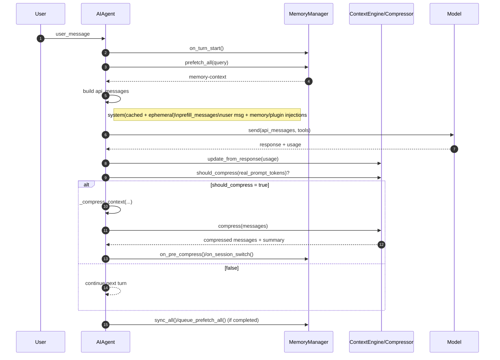

# 上下文 Context 系统 QA（含时序图）

> 本文聚焦 Hermes Agent 的 Context/Prompt 运行机制：分层结构、会话 prompt 组成、动态注入、system prompt 设计、Context 消耗估算、自动压缩触发与压缩保留策略。

---

## 1）Prompt 分了几层？层级关系是什么？

### A
按实现可分为两大层、七个子层：

### 顶层 A：缓存型 System Prompt（会话级）
由 `_build_system_prompt()` 构建并缓存，正常情况下不随每轮变化。

构建顺序（源码注释定义）：
1. Agent identity（SOUL.md 或默认身份）
2. 用户/网关传入 system_message（若有）
3. 持久记忆快照（MEMORY/USER）
4. Skills guidance
5. Context 文件（AGENTS.md / .cursorrules）
6. 当前时间
7. 平台提示

### 顶层 B：请求级动态层（每次 API 调用）
每次调用模型前，基于消息数组动态拼装：
- ephemeral_system_prompt（临时 system 扩展，不落盘）
- prefill_messages（插入到 system 后）
- external memory prefetch 结果（注入到 user 消息）
- 插件 user context 注入

这形成了“**稳定前缀 + 动态请求增强**”的双层架构。

---

## 2）一次会话的完整 Prompt 包含哪些内容？

### A
从一次 API 请求视角，完整 prompt =

1. `system` 消息（cached system prompt + 可选 ephemeral system）
2. 可选 prefill messages（紧接 system）
3. conversation history（user/assistant/tool）
4. 当前用户消息（其中可能拼入 memory-context / plugin user context）
5. 工具定义（tools schemas）

特别说明：
- memory provider tools 会并入 `self.tools`，因此“完整 prompt”不仅是文本，还包括可调用工具面。
- `approx_tokens = estimate_messages_tokens_rough(api_messages)` 用于本次请求体估算。

---

## 3）哪些 prompt 是运行时动态注入的？注入方式细节在哪？

### A
动态注入项主要有 4 类：

1. **ephemeral_system_prompt**
   - 在发送前拼接到 `effective_system`，不持久化到会话系统提示。

2. **prefill_messages**
   - 每次请求在 system 后插入。

3. **external memory prefetch**
   - 回合开始先 `prefetch_all(query)`，在构造 API 消息时将其（fenced block）拼入用户消息。

4. **plugin user context**
   - 与 memory prefetch 一样，拼接到用户消息层而非 system 层，以保护 system prefix cache 稳定。

源码重点看：
- `run_agent.py` 中 API 请求前的 `api_messages` 组装段（ephemeral、prefill、injection）。
- `agent/memory_manager.py` 的 `build_memory_context_block()`（memory fencing）。

---

## 4）给出 system prompt 的内容，并详细解读

### A
严格来说，system prompt 不是仓库里一个固定常量文本，而是 `_build_system_prompt()` 在运行时**按层拼装**出来的内容集合。其核心特征：

1. **身份层**：SOUL.md 优先，缺失时回退默认身份。
2. **工具行为层**：按加载到的工具名动态添加 MEMORY/SESSION_SEARCH/SKILLS 等指导。
3. **策略层**：tool-use enforcement、模型特化指导（如 OpenAI/Google 模型的执行规范）。
4. **记忆层**：内置 memory 快照 + 外部 memory provider system block。
5. **技能层**：skills 系统提示（当技能工具可用时）。
6. **上下文文件层**：项目本地规则文件（AGENTS.md 等）。

系统设计重点：
- system prompt 会缓存（仅在压缩轮转后重建），以提升 prefix cache 命中。
- 插件/外部动态注入尽量落在 user 消息侧，避免破坏稳定 system 前缀。

---

## 5）如何动态计算 Context 消耗？

### A
有两条路径：

1. **请求前粗估**
   - `estimate_messages_tokens_rough(api_messages)` 得到 `approx_tokens`。
   - 用于日志、预警、压缩前判定。

2. **响应后校正**
   - `context_compressor.update_from_response(usage_dict)` 用 provider 返回 usage 更新内部统计。
   - 压缩判定时优先使用 `last_prompt_tokens`（真实 prompt tokens）并排除 completion 干扰。

这是“估算 + 实测回填”的混合策略。

---

## 6）如何在恰当时机触发自动压缩？

### A
触发来源分三类：

1. **常规回合后判定触发**
   - 完成本轮后，若 `compression_enabled` 且 `should_compress(_real_tokens)` 为真，触发 `_compress_context(...)`。

2. **预检触发（进入主循环前）**
   - 已加载历史过大时，先做 preflight compression，避免请求直接失败。

3. **错误驱动触发**
   - 遇到 413 / context length exceeded 等错误，进入“压缩后重试”分支。

此外有防抖策略：
- compressor 有 anti-thrashing 逻辑，若连续压缩收益过低会跳过，提示用户 /new 或聚焦压缩。

---

## 7）压缩时历史消息保留策略是什么？什么内容会写入长期记忆？

### A
### 历史消息保留策略（ContextCompressor）
压缩流程是“保护头尾 + 压缩中段”：
1. 先裁剪旧 tool result（降噪）
2. 保护 head（系统提示与首段关键对话）
3. 在 token 预算下定位可压缩中段
4. 生成 summary/handoff 并回填
5. 保留 tail（最近消息）
6. 修复 tool_call/tool_result 配对，防止 orphan

因此不是等比截断，而是“结构化保留”。

### 什么写入长期记忆
- 内置 memory：只有显式 `memory` 工具写入（add/replace/remove）会落盘。
- 外部 provider：完整回合结束后 `sync_all(user, final_response)`；中断回合跳过。
- 压缩本身不会直接把所有被删历史写入长期记忆；它主要在会话内生成 summary，并在 session rotate 前触发 memory session commit / provider hooks。

---

## 单回合 Context 组装与压缩判定时序图

---

## 推荐源码阅读锚点

1. `run_agent.py`
   - `_build_system_prompt`
   - API 消息拼装（ephemeral/prefill/injection）
   - `approx_tokens` 估算、自动压缩触发与错误驱动压缩
   - `_compress_context`
2. `agent/context_compressor.py`
   - `should_compress`
   - `compress`（head/tail 保留与中段摘要）
3. `agent/memory_manager.py`
   - `build_memory_context_block`
   - `prefetch_all` / `sync_all` / `on_pre_compress`
