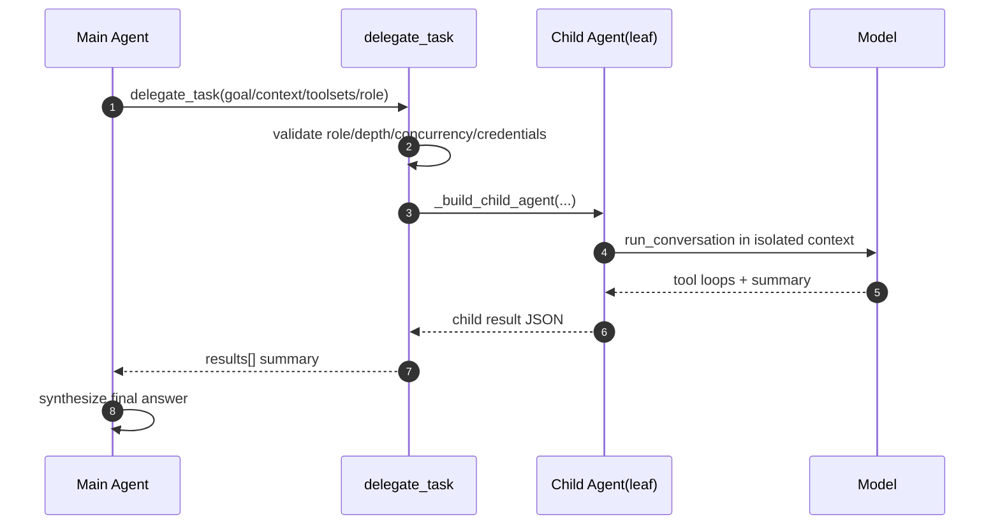
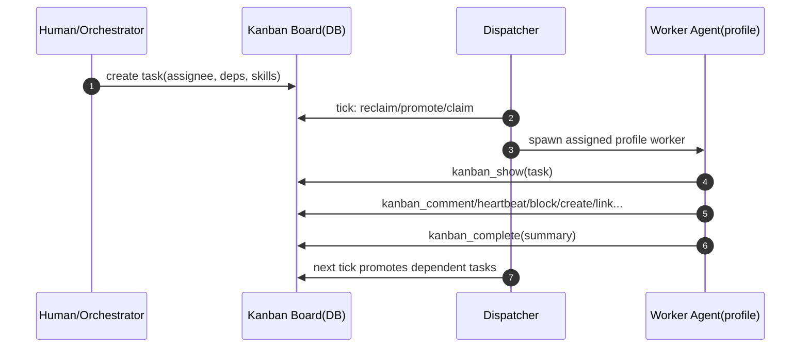

# 多 Agent 系统 QA（含时序图）

> 本文基于 Hermes 当前实现，回答普通 sub-agent、orchestrator、多 Agent 分类、团队协作（teammate-like）模式与链路问题。

---

## 1）普通 sub-agent 的实现机制是什么？

### A
普通 sub-agent 由 `delegate_task` 工具触发，核心机制是：

1. 父 agent 调用 `run_agent.py::_dispatch_delegate_task`，统一转发到 `tools/delegate_tool.py::delegate_task`。
2. `delegate_task` 支持 single/batch 两种模式；会做 role 归一化、并发上限、深度上限、凭据解析。
3. 通过 `_build_child_agent(...)` 构建子 `AIAgent`：
   - 子 agent 有独立 conversation / terminal / toolset
   - 工具集与父 agent 求交（防止越权），并剥离受限工具
4. 子 agent 在线程池中运行，返回 summary；父 agent 只看到总结，不接收子 agent 的完整中间轨迹。

默认普通 sub-agent 是 `leaf` 角色：不能继续委派。

---

## 2）main-agent 和 sub-agent 的协作机制是什么？

### A
是“父协调 + 子执行 + 汇总回传”的同步协作模型：

1. **任务下发**：主 agent 把 goal/context/toolsets 交给子 agent。
2. **隔离执行**：子 agent 在独立上下文执行，避免把大量中间推理污染父上下文。
3. **进度回传**：通过 progress callback 向父侧 UI/TUI 回传子任务进度事件。
4. **结果汇总**：子 agent 完成后返回 summary，父 agent 负责二次综合并给最终答复。
5. **中断联动**：父 agent 被中断时，子 agent 同步取消（非后台 durable）。

---

## 3）多 agent 在源码里分成哪几种？

### A
从源码能力看，至少有 4 类：

1. **Leaf Sub-agent（默认）**
   - 通过 `delegate_task` 生成，不能再委派。

2. **Orchestrator Sub-agent**
   - `role='orchestrator'`，可继续调用 `delegate_task`，形成嵌套树。
   - 受 `max_spawn_depth` 与 `orchestrator_enabled` 双重约束。

3. **Batch Parallel Children**
   - 一次 `tasks=[...]` 并发多个子 agent。
   - 受 `max_concurrent_children` 约束。

4. **Kanban Worker Agents（多 profile 协作）**
   - 由 dispatcher 按任务 assignee 拉起，走 `kanban_*` 工具链协作。
   - 与 `delegate_task` 并存，且 worker 内部可继续调用 delegate_task。

---

## 4）有没有团队协作 teammate 模式？

### A
**有“teammate-like”协作能力，但不是单独叫 `teammate` 的 API 模式。**

当前可对应两类：

1. `delegate_task` 的 orchestrator/worker 树（同一父回合同步协作）
2. Kanban 多 profile worker 协作（dispatcher + board + assignee）

其中 Kanban 更接近“团队协作模式”：不同 profile 像不同队友，任务通过 board 分发、依赖、回收与状态流转。

---

## 5）团队协作模式和普通 sub-agent 有什么区别？优缺点？

### A

## 5.1 区别

### 普通 sub-agent（delegate_task）
- 生命周期：绑定父回合，同步执行
- 数据面：父只拿 summary
- 调度：一次性调用内的并发/嵌套
- 适配场景：即时分治、短链路任务

### 团队协作（Kanban workers）
- 生命周期：由 dispatcher 周期调度，任务持久在 board
- 数据面：task/event/run/comment 持久化，支持依赖链
- 调度：按 assignee profile、状态机、TTL、reclaim 自动运行
- 适配场景：跨 profile、跨任务、长期运营型流程

## 5.2 优缺点

### 普通 sub-agent
- 优点：启动快、实现简单、对当前问答即时增益大
- 缺点：不可脱离父回合长期运行；状态持久性弱（主要靠 summary）

### 团队协作（Kanban）
- 优点：可持续调度、可观测、可恢复、任务治理能力强
- 缺点：系统复杂度更高，需要 board/dispatcher/profile 运营

---

## 6）如何决定“这是普通 subagent 还是 teammate”？

### A
可按“调度边界 + 生命周期”决策：

1. **如果任务必须在当前回复内完成，且以即时总结为主**：用普通 sub-agent（delegate_task）。
2. **如果任务需要跨 profile 分工、依赖编排、可回收重试、长期运行治理**：用 Kanban 团队协作模式。

在 `delegate_task` 内部，子类型由 `role` 决定：
- `leaf` => 普通 worker
- `orchestrator` => 可再分解的协调者

---

## 7）团队协作模式的工作链路是什么？

### A
以 Kanban 为主链路：

1. 人或上层 agent 创建任务（含 assignee/profile/依赖/技能）。
2. dispatcher 周期扫描：reclaim、promote ready、claim、spawn worker。
3. worker 进程读取 `HERMES_KANBAN_TASK`，加载 `kanban_*` toolset。
4. worker 通过 `kanban_show / kanban_comment / kanban_complete / kanban_block / kanban_create / kanban_link / kanban_heartbeat` 驱动任务。
5. 完成后写回 run summary / events；下游依赖任务被推进到 ready。

这是一种“任务板驱动”的多 agent 编排，不依赖单个 parent turn 存活。

---

## 时序图 1：普通 sub-agent（delegate_task）

---

## 时序图 2：团队协作（Kanban dispatcher + workers）

---

## 关键源码锚点

1. `run_agent.py::_dispatch_delegate_task`
2. `tools/delegate_tool.py::delegate_task`
3. `tools/delegate_tool.py::_build_child_agent`
4. `tools/delegate_tool.py::_build_child_system_prompt`
5. `website/docs/user-guide/features/kanban.md`（团队协作 worker/dispatcher/toolset 机制）
