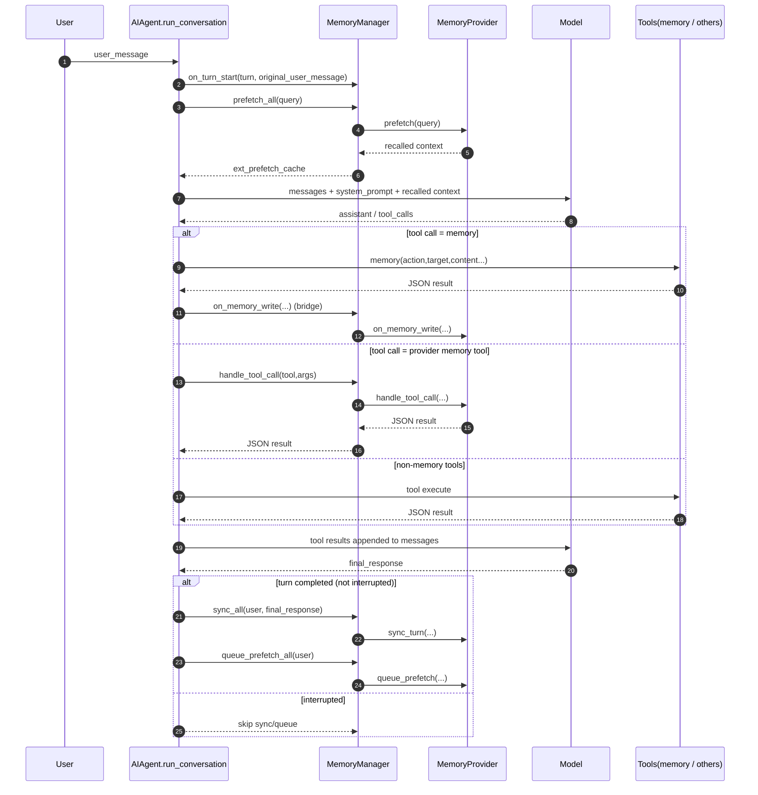

# 记忆系统 QA（含单回合 Memory 时序图）

> 本文是对 Hermes Agent 记忆系统的针对性问答，聚焦：短期记忆、长期记忆、保存/召回时机、Agent Memory 与 Team Memory 边界、以及运行时与 Prompt/Tools 的动态拼接。

---

## Q1：短期记忆怎么保存？有没有丢弃机制？具体怎么丢弃？

### A
Hermes 的短期记忆主要是 **当前会话消息序列（messages）+ 会话持久层（SessionDB）**。

- 在 `run_conversation` 中，用户消息先 append 到 `messages`，后续 assistant/tool 消息持续追加，构成短期上下文。
- 丢弃机制存在，核心是 **context compression**。

#### 丢弃/压缩流程
1. 达到上下文压力后，调用 `context_compressor.compress(...)` 生成压缩后的消息集合。
2. 旧 session 结束，创建新 session_id，继承 parent_session_id。
3. 新会话不再携带完整旧消息，只保留压缩后的有效上下文与必要锚点。
4. 通知 memory provider 发生 session switch，避免 provider 内部会话态串线。

这意味着短期记忆的“丢弃”是**受控压缩淘汰**，而不是粗暴清空。

---

## Q2：长期记忆保存方案是什么？用到了哪些技术？

### A
Hermes 长期记忆分两层：

### 1）内置持久记忆（本地文件）
- `MEMORY.md`：Agent 个人工作记忆（环境事实、项目约定等）
- `USER.md`：用户画像（偏好、沟通习惯等）

技术点：
- 文件锁（lock file）保证并发写安全
- 原子写入（temp + replace）保证文件完整性
- 内容安全扫描（注入/外泄 pattern）
- 字符上限（memory/user 分开限额）
- 快照注入：会话开始时冻结 system prompt 记忆块，中途写入不改当前会话 system prompt（保证 prefix cache 稳定）

### 2）外部 Memory Provider（插件化）
- 通过 `MemoryProvider` 抽象接口接入（initialize/prefetch/sync_turn/tool schemas 等）
- `MemoryManager` 统一编排，限制“最多一个 external provider”避免冲突
- 常见技术能力：语义检索、用户画像卡片、结论写入、异步预取线程

---

## Q3：什么时候保存长期记忆？

### A
分两类触发：

1. **显式工具写入**（内置 memory tool）
   - 调用 `memory(action=add/replace/remove, target=memory|user, ...)` 时即时落盘。

2. **回合结束同步写入**（external provider）
   - 完整回合结束后调用 `sync_all(user, assistant)`。
   - 同时调用 `queue_prefetch_all(user)`，预热下一轮召回。
   - 若回合中断（interrupt），会跳过 sync，避免把不完整输出写入长期记忆。

此外，内置 `memory` 工具写 user 时，会桥接触发 provider 的 `on_memory_write`（例如 Honcho 将其镜像为 conclusion）。

---

## Q4：长期记忆什么时候被召回？

### A
在每轮主循环前：

1. `on_turn_start(...)` 通知 provider 新回合开始（用于 cadence 控制）
2. `prefetch_all(query)` 拉取召回上下文
3. 本轮缓存 `_ext_prefetch_cache`，避免 tool-loop 内重复多次召回

`MemoryManager` 会把 provider 返回文本聚合，必要时包装成 memory-context 块供模型消费。

---

## Q5：Agent Memory 和 Team Memory 的边界是什么？

### A
代码里没有统一命名为 “TeamMemory” 的类，但可以从作用域看边界：

### Agent Memory（本地、agent 视角）
- `MEMORY.md`：Agent 工作记忆
- `USER.md`：该 agent 对用户画像
- profile-scoped 存储目录：`$HERMES_HOME/memories`

### Team/Shared Memory（provider 视角）
- 以 Honcho 为例，数据面向 `peer`（`user`、`ai` 或任意 workspace peer）
- 支持跨 peer 检索/推理/结论写入，更接近“团队/工作空间共享记忆”

因此边界可理解为：
- 本地双文件是 agent-local durable memory
- provider 的 peer/workspace 语义承载 team/shared memory

---

## Q6：agent 运行时怎么把 memory 动态拼接到 prompt、tools 等？

### A
可以分为 4 个拼接面：

1. **System Prompt 静态层**
   - `_build_system_prompt()` 拼接内置 memory 快照 + external provider system block
   - 首轮构建后缓存（prefix cache 友好）

2. **Turn Context 动态层**
   - 每轮 prefetch 召回相关长期记忆，作为本轮上下文增强

3. **Tool 能力层**
   - memory provider 的 tool schemas 注入 `self.tools`
   - 调用分流：内置 `memory` 走内置分支；provider memory tools 走 `memory_manager.handle_tool_call`

4. **回写闭环层**
   - 回合末 `sync_all + queue_prefetch_all`，形成“写入长期记忆 -> 下轮召回”的闭环

---

## 单回合 Memory 时序图

---

## 补充说明

- 内置 memory 快照是“会话开始冻结”的，中途 memory 写入会持久化到磁盘，但不会改当前会话的 system prompt 快照；下一会话才会刷新。
- context compression 发生时，会触发 session 轮转，并通知 memory provider 做 on_session_switch，从而保持长期记忆会话一致性。
